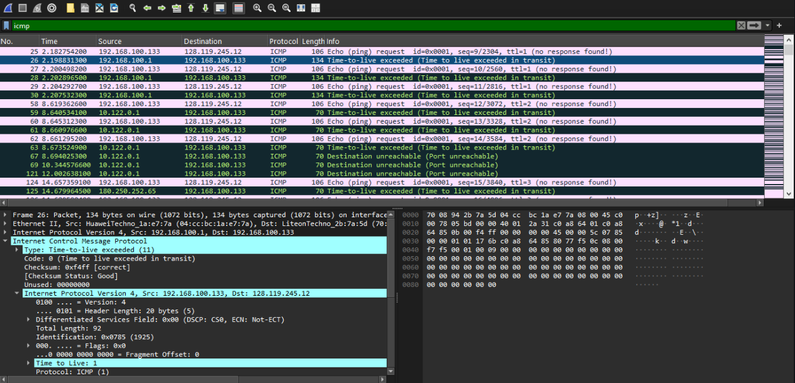
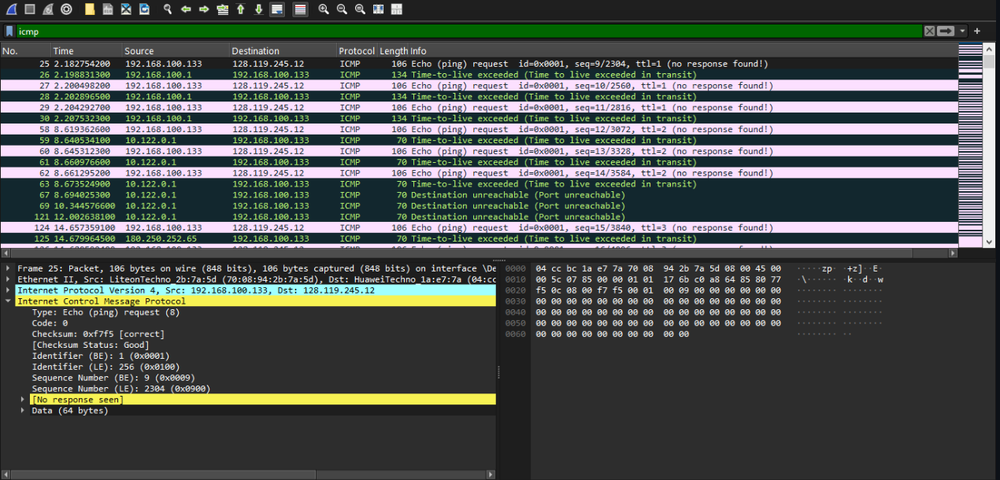

# IP (Internet Protocol)
### Datagram IPv4 dan IPv6 menggunakan Wireshark

#### Nama : I Wayan Juanesa Ryan Pradita
#### NIM : 103072430012
#### Kelas : IF-04-04

## 📝 Hasil Analisis IPv4

Evaluasi terhadap traffic jaringan saat mengeksekusi perintah tracert gaia.cs.umass.edu menghasilkan data spesifik mengenai arsitektur header IPv4 pada paket ICMP Echo Request sebagai berikut:

1. Parameter Header

Source Address (192.168.56.1): Identitas numerik perangkat yang menginisiasi pengiriman data.

Destination Address (128.119.245.12): Alamat komputer target yang dituju.

Protocol (ICMP / 1): Protokol lapisan atas yang dienkapsulasi oleh IP.

Header Length (20 bytes): Dimensi baku dari header IP (tanpa field Options).

Total Length (92 bytes): Kuantitas ukuran total yang memadukan header dengan komponen data.

2. Karakteristik Time to Live (TTL)

Dalam proses penelusuran rute, parameter TTL memegang peranan penting untuk mengukur estimasi jarak perangkat (hop) secara logis. Secara teknis, setiap kali paket data melintasi sebuah gerbang router, nilai TTL akan didekremasi (dikurangi) sebesar 1. Jika angka TTL tereduksi hingga mencapai nilai 0, router akan mendrop paket tersebut sekaligus mengirimkan feedback berupa notifikasi ICMP Time Exceeded kepada pihak pengirim.

## 🌍 Telaah IPv6

Dari hasil komparasi, IPv6 menunjukkan peningkatan arsitektur yang signifikan dibanding pendahulunya:

Menggunakan skema pengalamatan 128-bit yang menjamin ketersediaan jumlah IP dalam skala masif.

Header memiliki ukuran konstan (40 bytes) karena fungsi seperti Checksum dan kontrol Fragmentation dipisahkan dari header primer, sehingga meningkatkan efisiensi komputasi pada router.

Memiliki efisiensi yang lebih baik dalam manajemen kualitas layanan jaringan (QoS)