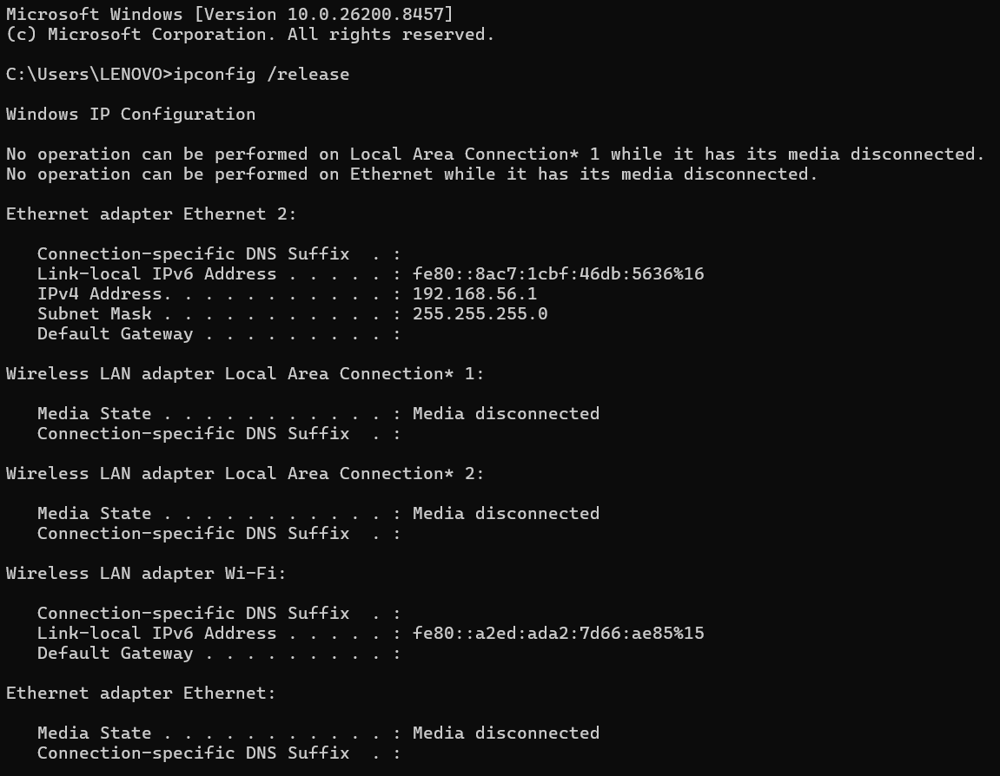
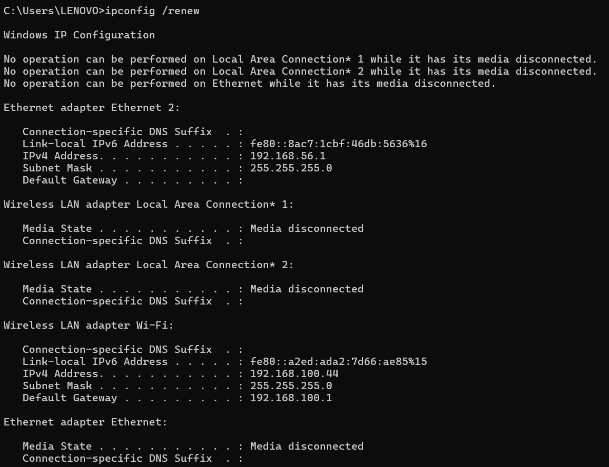
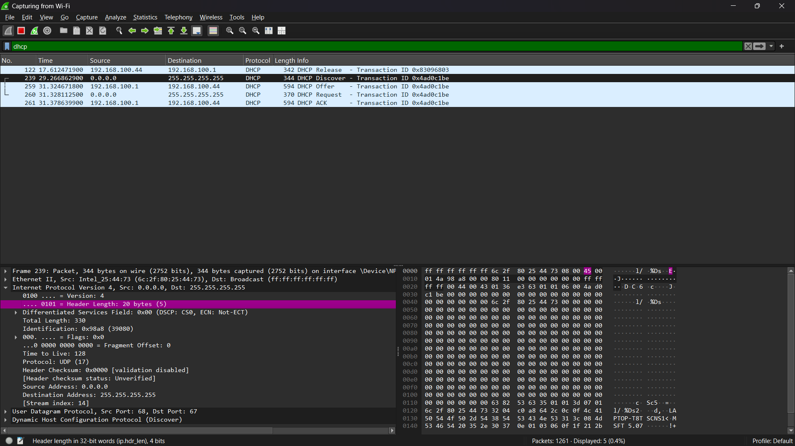

# DHCP (*Dynamic Host Configuration Protocol*)
### Mekanisme Pengalamatan Dinamis menggunakan Wireshark

#### Nama : I Wayan Juanesa Ryan Pradita
#### NIM : 103072430012
#### Kelas : IF-04-04

## 🚀 Langkah Praktikum
1. Aktifkan aplikasi Wireshark dan arahkan monitoring pada interface jaringan Wi-Fi yang sedang aktif.
2. Terapkan fungsionalitas filter dengan mengetik kata kunci dhcp pada kolom filter Wireshark untuk menyaring trafik yang tidak relevan.
3. Buka aplikatif Command Prompt (CMD) pada sistem operasi Windows.
4. Eksekusi perintah ipconfig /release. Langkah ini bertujuan untuk melepas konfigurasi IP Address yang sedang melekat pada Wireless LAN adapter Wi-Fi sehingga statusnya kosong (terputus sementara).

5. Jalankan proses packet capturing di Wireshark, kemudian segera ketik dan jalankan perintah ipconfig /renew di CMD untuk menginisiasi permintaan IP baru ke server/router.

6. Setelah status IP baru berhasil didapatkan oleh sistem, hentikan proses perekaman paket di Wireshark untuk mulai melakukan analisis.

## 📝 Tinjauan Data & Analisis DHCP
Berdasarkan observasi log aktivitas jaringan yang terekam pada Wireshark dan utilitas IPConfig, berikut adalah ringkasan parameter teknis yang berhasil dibedah:

1. Karakteristik Lapisan Transport (UDP)
Operasional DHCP berjalan di atas protokol connectionless UDP (User Datagram Protocol) dengan port spesifik:

- Port Asal (Source): 68 — Digunakan oleh sisi klien (DHCP Client).

- Port Tujuan (Destination): 67 — Digunakan oleh sisi server (DHCP Server).

2. Alur Transmisi Sesi DORA & Release
Rekaman paket pada Wireshark (Stream Index 14) memperlihatkan sekuens pertukaran pesan berikut:
- Paket 122 (DHCP Release): Dikirim secara unicast dari host (192.168.100.44) menuju server (192.168.100.1) dengan Transaction ID 0x83096803 untuk melepaskan sewa IP sebelumnya.
- Paket 239 (DHCP Discover): Klien menyiarkan pesan broadcast dari IP kosong 0.0.0.0 ke alamat global 255.255.255.255 dengan token penanda sesi 0x4ad0c1be.
- Paket 259 (DHCP Offer): Server (192.168.100.1) membalas dengan menawarkan alokasi IP Address 192.168.100.44.
- Paket 260 (DHCP Request): Klien menegaskan permintaan formal untuk meminjam konfigurasi IP yang ditawarkan melalui mekanisme broadcast.
- Paket 261 (DHCP ACK): Server memberikan persetujuan final, menandai selesainya proses penyerahan IP baru ke interface Wi-Fi klien.

3. Bedah Parameter Header Datagram (Paket 239)
Inspeksi mendalam pada struktur internal paket DHCP Discover menyingkap karakteristik berikut:
- Versi IP: IPv4 (Internet Protocol Version 4).
- Panjang Header: 20 bytes (Direpresentasikan dengan nilai bit 5).
- Ukuran Paket (Total Length): 330 bytes.
- Token Transaksi (Transaction ID): 0x4ad0c1be — Berfungsi sebagai pengidentifikasi unik agar paket balasan terarah pada urutan yang tepat.