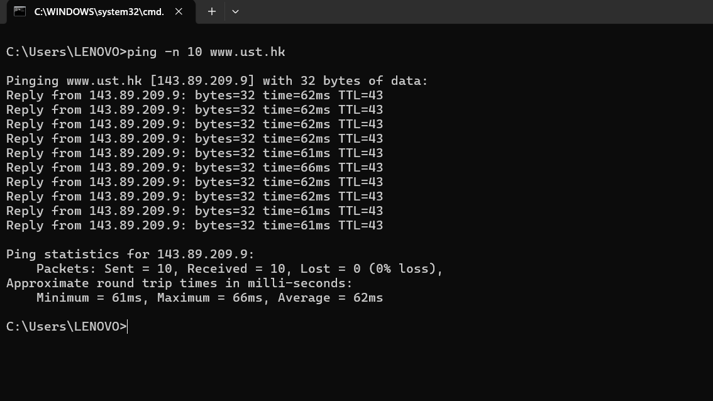
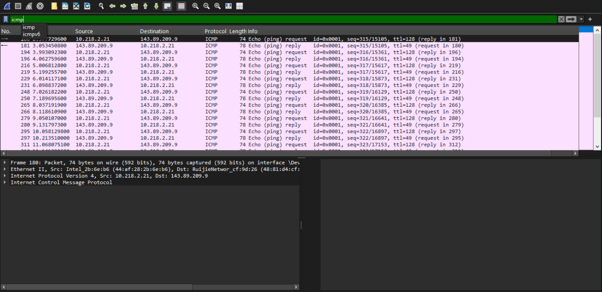
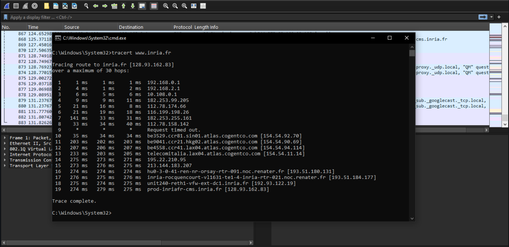
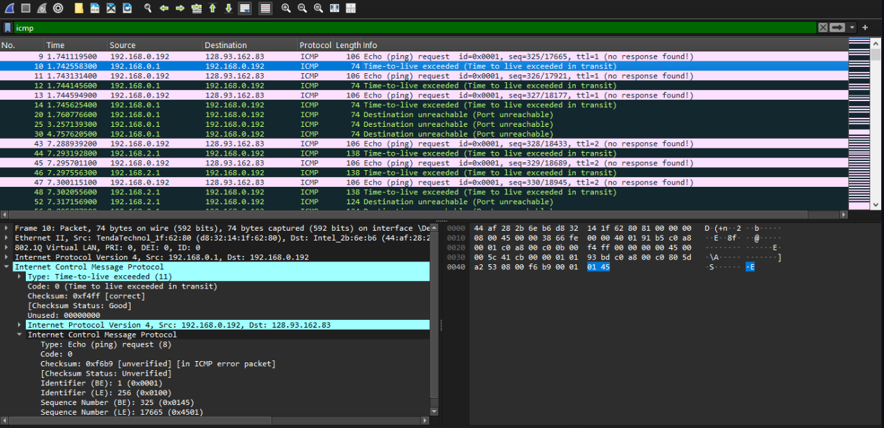

# ICMP (*Internet Control Message Protocol*)
### Analisis Perilaku Pesan Kendali Jaringan dan Mekanisme Diagnostik Utilitas Jaringan

#### Nama : I Wayan Juanesa Ryan Pradita
#### NIM : 103072430012
#### Kelas : IF-04-04

## 📝 Hasil Pengujian & Analisis ICMP
1. Evaluasi Protokol Melalui Fungsi Ping
Eksekusi perintah ping -n 10 www.ust.hk mengonfirmasi resolusi pemetaan domain ke IP 143.89.209.9. Dari total 10 transmisi paket data, parameter keandalan jaringan mencatat efisiensi 100% (0% packet loss).

Berdasarkan rekaman pada layer data Wireshark, fenomena sinkronisasi antara host pengirim (10.218.2.21) dan target (143.89.209.9) dapat diidentifikasi melalui struktur penggalan paket 180 dan 181 berikut:

- Echo Request (Paket 180): Dikirimkan dengan parameter Type: 8 dan Code: 0. Klien menyertakan Sequence Number bernilai 315 (0x013b) serta nilai Identifier bernilai 1.
- Echo Reply (Paket 181): Diterima kembali dari server dengan parameter Type: 0 dan Code: 0. Paket balasan ini mempertahankan nilai Sequence Number (315) dan Identifier (1) yang identik dengan paket permintaan.
- Prinsip Korelasi Data: Kesamaan nilai Sequence Number dan Identifier pada kedua segmen paket ini merupakan syarat mutlak bagi network stack sistem operasi untuk melacak reliabilitas koneksi dan mengalkulasi metrik Round-Trip Time (RTT) secara akurat.

2. Analisis Mekanisme Ekskalasi TTL pada Traceroute

Aktivitas pelacakan jalur menuju www.inria.fr (128.93.162.83) diselesaikan melalui skema 19 hop. Karakteristik transmisi menunjukkan variasi latensi yang berbanding lurus dengan jarak geografis router perantara:

- Segmen Internal Jaringan: Paket melintasi gerbang lokal pada hop 1 (192.168.0.1), hop 2 (192.168.2.1), dan hop 3 (10.108.0.1) dengan durasi respons berkisar antara 1–6 ms.

- Segmen Transit Internasional: Lonjakan latensi terjadi saat memasuki jaringan backbone global hingga akhirnya paket mendarat di server tujuan dengan waktu respons akhir mencapai 275 ms pada hop 19.

- Mekanisme Umpan Balik Galat (Error Reporting): Utilitas tracert pada sistem operasi Windows terbukti memanfaatkan paket ICMP secara berulang dengan meningkatkan nilai TTL secara berkala (TTL=1, TTL=2, dst). Ketika paket dengan properti TTL=1 mencapai router pertama, batas waktu hidup paket terlampaui sehingga router mendrop data tersebut. Sebagai kompensasinya, router mengirimkan balik notifikasi ICMP Type 11 (Time-to-live exceeded) dengan Code: 0. Paket galat ini (seperti pada Paket 10) melampirkan kembali salinan header asli untuk mempermudah identifikasi paket pada sisi klien.