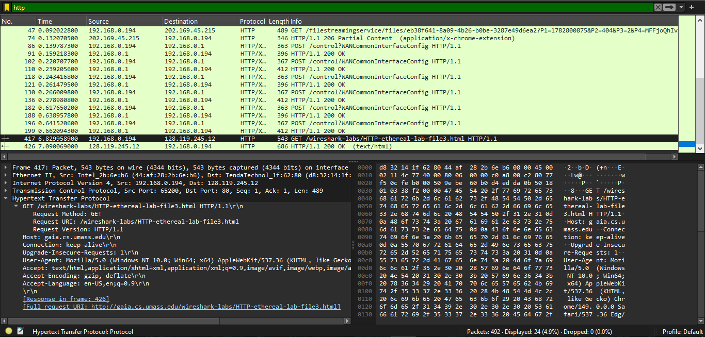
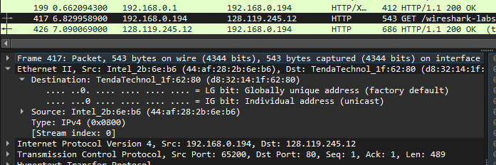
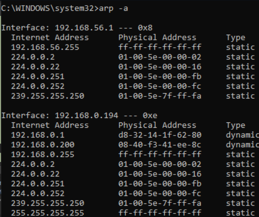
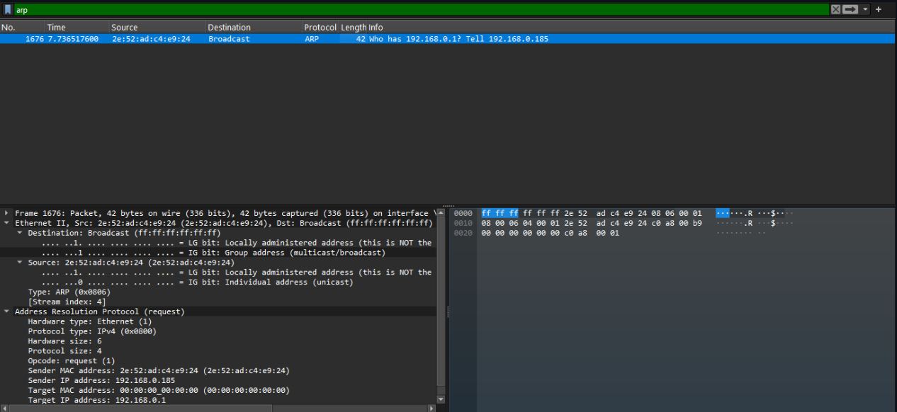

# Modul 13 Protokol Ethernet dan Address Resolution Protocol (ARP)
### Investigasi Struktur Frame Data Link Layer dan Analisis Mekanisme Resolusi Alamat Fisik

#### Nama    : I Wayan Juanesa Ryan Pradita 
#### NIM     : 1030724s0012  
#### Kelas   : IF-04-04

---

HTTP bekerja pada Application Layer (Lapisan Aplikasi) yang berfungsi untuk mentransfer dokumen web antara web server dan web browser. Namun, agar data dari lapisan atas dapat mencapai tujuannya di jaringan fisik, diperlukan pemetaan alamat logis (IP Address) ke alamat fisik (MAC Address). Di sinilah protokol ARP pada Data Link Layer memegang peranan penting. Tanpa mekanisme resolusi alamat dari ARP, perangkat di jaringan lokal tidak akan tahu ke mana harus meneruskan frame data, meskipun IP Address tujuan sudah diketahui. Melalui praktikum ini, dilakukan capturing paket data secara langsung untuk menganalisis perilaku, struktur header, dan mekanisme kerja dari protokol HTTP dan ARP.

### Melakukan Capture Aktivitas HTTP Request

- Daftar Paket (Panel Atas): Menampilkan rentetan lalu lintas HTTP yang terjadi di jaringan. Fokus utama berada pada Frame 417 (baris hitam yang disorot), di mana komputer praktikan dengan IP 192.168.0.194 mengirimkan permintaan (Request) menggunakan metode GET menuju alamat IP 128.119.245.12. Permintaan ini ditujukan untuk mengambil sebuah halaman web spesifik bernama /wireshark-labs/HTTP-ethereal-lab-file3.html.
- Detail Paket (Panel Bawah Kiri): Menunjukkan struktur enkapsulasi data dari protokol HTTP tersebut. Di sini terlihat informasi penting seperti Host server tujuan (gaia.cs.umass.edu), jenis browser yang digunakan (User-Agent), serta jenis data yang siap diterima (Accept: text/html).
- Hex Dump (Panel Bawah Kanan): Menampilkan representasi data mentah dalam bentuk bilangan Heksadesimal dan karakter ASCII dari paket data yang sedang disorot.

### Menganalisis Enkapsulasi Protokol HTTP dan Informasi Gateway

- Destination (Alamat Tujuan MAC): Tertera TendaTechnol_1f:62:80 atau alamat lengkapnya d8:32:14:1f:62:80. Poin krusial di sini adalah MAC address tujuan bukan milik server web tujuan, melainkan milik Default Gateway (router Tenda) yang ada di jaringan lokal praktikan.
- Source (Alamat Asal MAC): Tertera Intel_2b:6e:b6 atau 44:af:28:2b:6e:b6, yang merupakan alamat fisik (Network Interface Card/NIC) dari laptop atau PC praktikan.
- Fungsi Analisis: Gambar ini membuktikan bahwa jika sebuah komputer ingin mengirimkan data ke internet (luar jaringan lokal), paket data tersebut secara fisik harus dikirimkan terlebih dahulu ke router lokal (gateway) sebagai perantara.

### Memeriksa Tabel ARP Cache pada Host Lokal

Command Prompt (CMD) Windows setelah dijalankan perintah arp -a. Perintah ini berfungsi untuk melihat tabel ARP Cache, yaitu tabel memori sementara yang menyimpan pasangan IP Address dan MAC Address perangkat lain.

- Interface 192.168.0.194: Ini adalah kartu jaringan utama komputer praktikan.
- Pencocokan Data: Perhatikan baris pertama di bawah interface tersebut, terdapat Internet Address 192.168.0.1 (IP dari router/gateway) yang berpasangan dengan Physical Address d8-32-14-1f-62-80 dengan tipe dynamic.
- Fungsi Analisis: Alamat MAC ini sama persis dengan Destination MAC pada Gambar 2. Gambar ini menjelaskan mengapa komputer praktikan pada Gambar 2 bisa langsung tahu ke mana harus mengirimkan paket: karena komputer sudah menyimpan informasi MAC Address milik router di dalam tabel ARP-nya.

### Menganalisis Mekanisme ARP Broadcast di Jaringan

- Pesan Info Jaringan: Di panel atas tertulis pesan "Who has 192.168.0.1? Tell 192.168.0.185". Artinya, ada komputer dengan IP 192.168.0.185 yang sedang kebingungan mencari tahu siapa pemilik IP 192.168.0.1.
- Mekanisme Broadcast (Layer 2): Pada bagian Destination di Ethernet II, alamat tujuan diatur ke Broadcast (ff:ff:ff:ff:ff:ff). Ini berarti paket pertanyaan ini diteriakkan/dikirimkan ke seluruh komputer yang ada di ruangan atau jaringan tersebut.
- Address Resolution Protocol (Request): Di panel bawah, kolom Target MAC address diisi dengan angka nol semua (00:00:00:00:00:00). Ini adalah indikator bahwa MAC Address target statusnya belum diketahui dan sedang ditanyakan melalui proses request ini. Komputer yang memiliki IP 192.168.0.1 nantinya akan menjawab secara pribadi (unicast) untuk memberitahukan MAC Address aslinya.

---

### Kesimpulan
Berdasarkan seluruh hasil pengujian dan analisis tangkapan layar di atas, dapat disimpulkan beberapa hal berikut:

1. Keterkaitan Antar Layer: Pengiriman paket data pada jaringan komputer melibatkan enkapsulasi dari layer atas hingga layer bawah. Terbukti pada komunikasi HTTP (Layer 7) yang memanfaatkan TCP (Layer 4), IP (Layer 3), dan Ethernet (Layer 2) agar paket bisa sampai ke tujuan dengan tepat.
2. Peran Vital ARP: Protokol ARP bertindak sebagai jembatan penting untuk memetakan alamat logis (IP Address) ke alamat fisik (MAC Address) di jaringan lokal. Tanpa adanya proses ARP Broadcast untuk mendeteksi MAC address Default Gateway, host lokal tidak akan pernah bisa melakukan routing paket data ke server eksternal di internet (seperti server UMass pada pengujian HTTP).
3. Efisiensi Tabel ARP: Sistem operasi menyimpan hasil pencarian ARP di dalam tabel cache lokal secara dinamis guna mengurangi beban trafik broadcast yang berlebihan di dalam jaringan.