# Modul 14 Protokol Jaringan Nirkabel IEEE 802.11 (Wi-Fi)
### Investigasi Mekanisme Transmisi Nirkabel, Beaconing, dan Manajemen Asosiasi Paket

#### Nama    : I Wayan Juanesa Ryan Pradita 
#### NIM     : 1030724s0012  
#### Kelas   : IF-04-04

---

### Deskripsi Topologi dan Rangkaian Aktivitas Rekaman Trafik

Proses penyadapan paket (packet capturing) dilakukan pada Frekuensi Saluran 6 (Channel 6) di dalam sebuah arsitektur jaringan domestik. Infrastruktur ini mengintegrasikan satu unit AP/Router Linksys berbasis teknologi 802.11g, sepasang komputer personal (PC) berbasis media kabel, serta sebuah perangkat klien nirkabel (wireless host). Kronologi interaksi data yang berhasil didokumentasikan di dalam sistem adalah sebagai berikut:
- Kondisi Awal: Komputer nirkabel berada dalam status terhubung (authenticated & associated) dengan titik akses (AP) beridentitas 30 Munroe St.
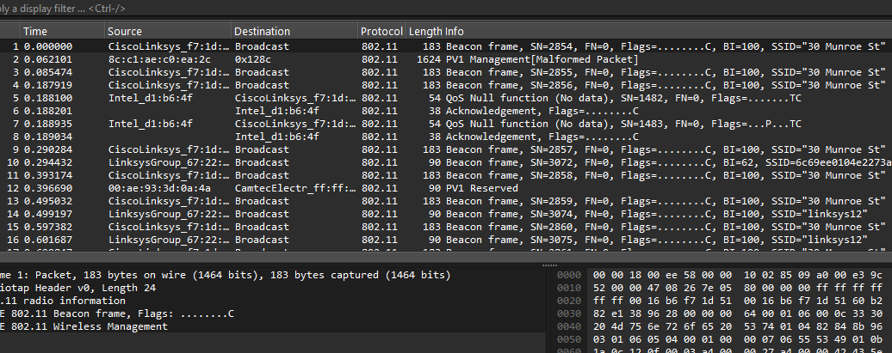

- Detik ke-24.82 (t = 24.82 s): Perangkat klien mengirimkan instruksi HTTP GET request ke server gaia.cs.umass.edu (dengan alamat IP 128.119.245.12) untuk mengunduh dokumen teks eksternal bernama alice.txt.
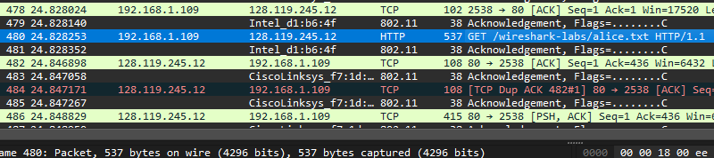

- Detik ke-32.82 (t = 32.82 s): Perangkat klien kembali menginisiasi instruksi HTTP GET request yang ditujukan ke server www.cs.umass.edu (dengan alamat IP 128.119.240.19).
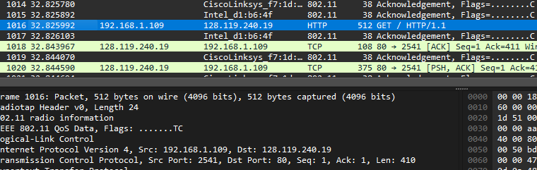

- Detik ke-49.58 (t = 49.58 s): Komputer nirkabel secara manual memutuskan koneksi (disassociation) dari AP 30 Munroe St dan berupaya melakukan registrasi ke jaringan berproteksi khusus bernama linksys_ses_24086 (namun statusnya gagal tersambung).
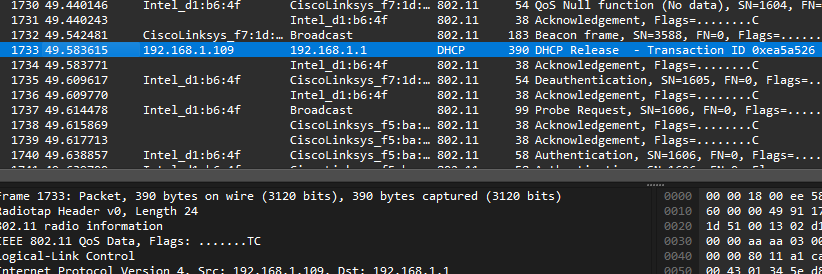

- Detik ke-63.00 (t = 63.00 s): Komputer nirkabel menghentikan proses pemindaian ke AP kedua, kemudian melakukan proses pemulihan hubungan resmi kembali (re-association) dengan AP awal, 30 Munroe St.
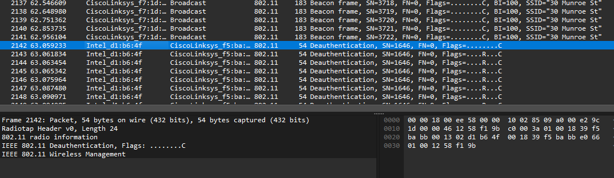

---

### Kajian Eksperimen I: Karakteristik Beacon Frames

Beacon Frames diudarakan secara periodik oleh perangkat Access Point (AP) sebagai sarana publikasi informasi keberadaan, parameter operasional, serta spesifikasi teknis dari jaringan nirkabel tersebut kepada perangkat-perangkat di area jangkauannya.
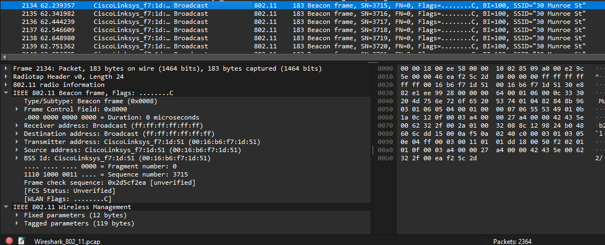

Melalui investigasi pada sub-lapisan IEEE 802.11 Wireless LAN di panel informasi Wireshark, frame Beacon mengidentifikasi karakteristik berikut:

- Tipe & Sub-tipe (Type / Subtype): Tercatat nilai Type: Management frame (0) dan Subtype: Beacon frame (8). Konfigurasi nilai biner ini menjadi standar mutlak yang menandakan bahwa paket mengemban tugas administratif koordinasi jaringan nirkabel.

- Parameter SSID: Menampilkan label pengenal tekstual dari jaringan Wi-Fi terkait (misalnya: 30 Munroe St).

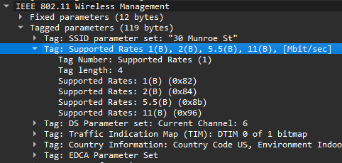

- Kapasitas Transmisi (Supported Rates): Menginfokan batas kecepatan transfer data tertinggi (bandwidth) yang mampu diakomodasi oleh komponen fisik pemancar pada Access Point.

--- 

### Kajian Eksperimen II: Mekanisme Pengiriman Data (Data Transfer)

Pemantauan proses pertukaran data udara diteliti secara khusus pada jendela waktu pengunduhan file teks alice.txt, tepat ketika bagian enkapsulasi data dari lapisan atas mulai ditransmisikan melintasi medium nirkabel.

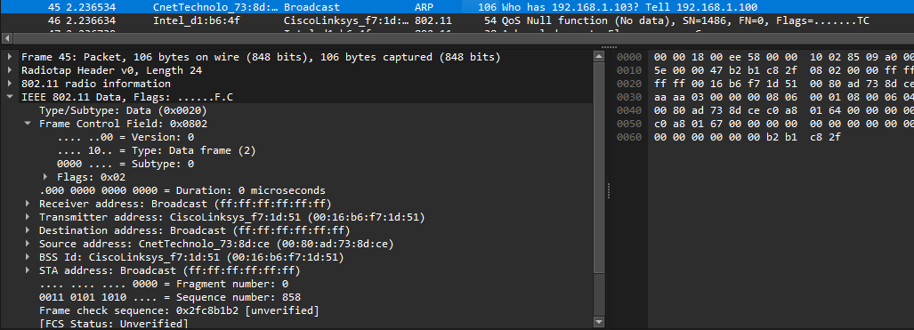

Berbeda signifikan dengan arsitektur bingkai Ethernet kabel konvensional yang hanya memuat dua jenis alamat fisik (Source dan Destination), struktur bingkai data standar 802.11 menerapkan regulasi skema 4 alamat fisik di dalam komponen header utamanya. Skema ini dirancang khusus untuk menjembatani konversi data antara medium udara dan medium kabel via Distribution System (DS):

- Alamat 1 (Receiver Address): Alamat fisik milik antarmuka nirkabel yang menjadi penerima langsung paket di udara (umumnya merupakan MAC Address dari perangkat AP).
- Alamat 2 (Transmitter Address): Alamat fisik dari stasiun nirkabel yang melepaskan/mengirimkan paket secara langsung (yaitu MAC Address dari perangkat klien).
- Alamat 3 (Destination Address): Alamat fisik titik akhir atau target muatan data di area jaringan kabel (misalnya MAC Address dari komponen router atau server luar tujuan).
- Alamat 4 (Source Address): Alamat fisik milik aktor pembuat paket data pertama kali di area jaringan berkabel (digunakan jika lalu lintas data datang dari arah luar jaringan menuju host nirkabel).

---

### Kajian Eksperimen III: Proses Asosiasi dan Disasosiasi Perangkat (Association & Disassociation)

Selaras dengan visualisasi garis waktu aktivitas praktikum, fase terminasi paksa (Disassociation) serta fase registrasi ulang (Association) terdeteksi secara valid pada rentang waktu krusial antara t = 49.58 detik hingga t = 63.00 detik.

Alur Kerja Pertukaran Paket Manajemen Wi-Fi
- Disassociation (Pemutusan Hubungan): Paket ini ditransmisikan oleh komputer klien dengan tujuan menghapus status sesi logis yang tengah berjalan. Di dalam sistem, paket manajemen ini dikelompokkan ke dalam kategori Type 0 (Management) disertai penanda khusus Subtype 12 (Disassociation).
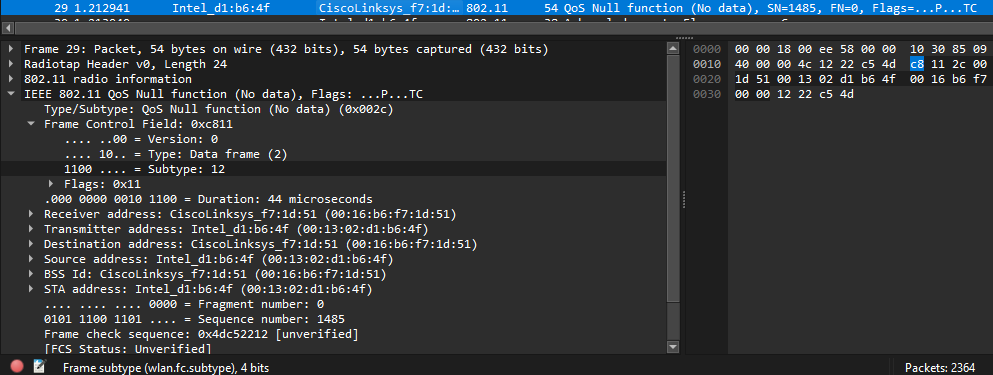

- Association Request (Permintaan Asosiasi): Paket dikirimkan oleh stasiun nirkabel menuju target pemancar (dalam kasus ini ke linksys_ses_24086, lalu kemudian kembali ke 30 Munroe St) untuk mengajukan permohonan validasi enkripsi serta penempatan sumber daya pada jaringan lokal. Struktur paket ini ditandai dengan kode Type 0 (Management) dan Subtype 0 (Association Request).
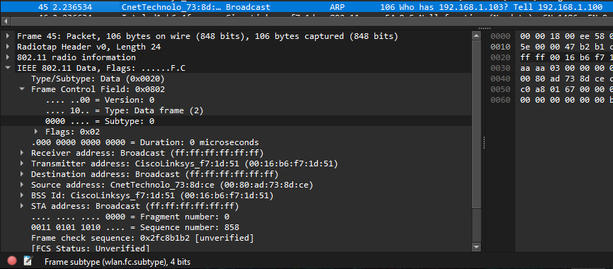

- Association Response (Jawaban Asosiasi): Paket dikirimkan balik oleh infrastruktur Access Point (AP) menuju perangkat klien sebagai bentuk konfirmasi formal apakah sesi koneksi diterima atau ditolak. Paket ini memiliki identitas Type 0 (Management) dan Subtype 1 (Association Response). Di dalam muatannya, terkandung status informatif seperti Successful (jika terhubung) atau pemaparan alasan penolakan jika koneksi gagal (Status Code).
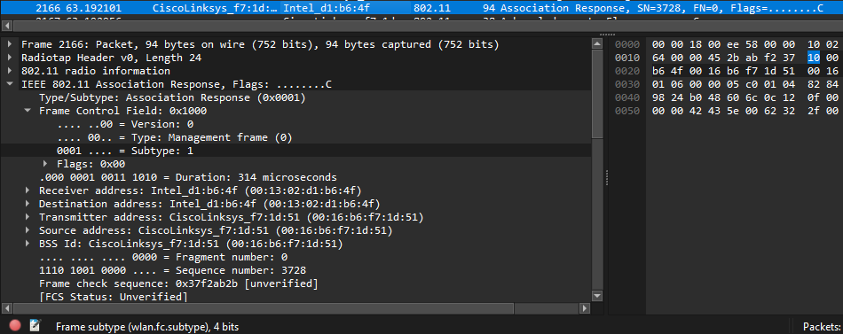
