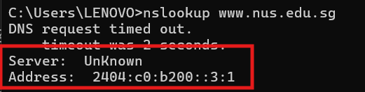
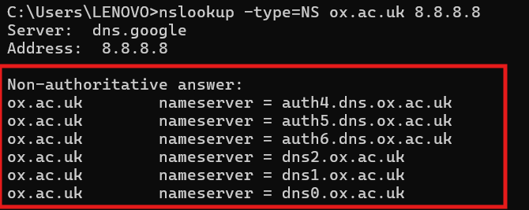
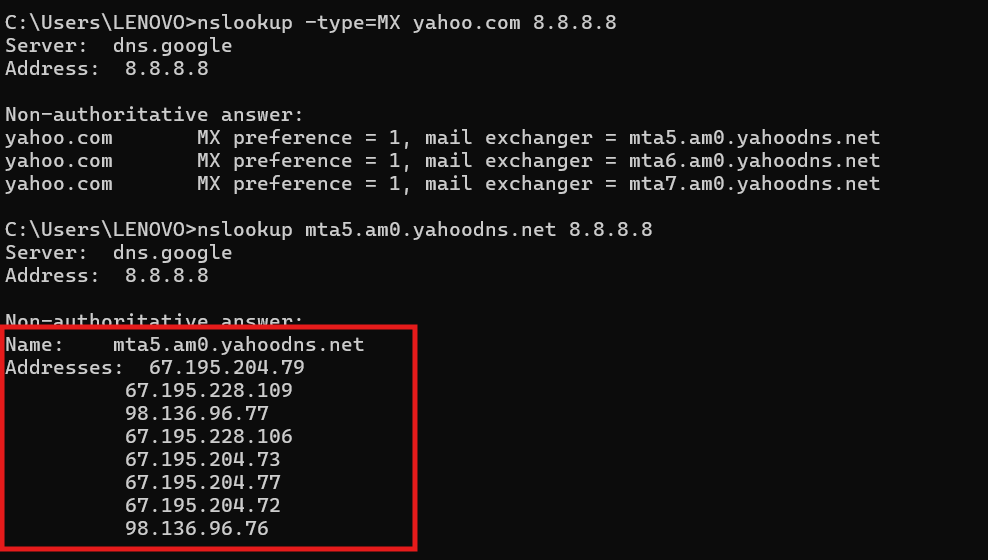

#### Nama : I Wayan Juanesa Ryan Pradita
#### NIM : 103072430012
#### Kelas : IF-04-04
# Pertanyaan

1. Jalankan nslookup untuk mendapatkan alamat IP dari server web di Asia. Berapa alamat IP 
server tersebut?
2. Jalankan nslookup agar dapat mengetahui server DNS otoritatif untuk universitas di Eropa.
3. Jalankan nslookup untuk mencari tahu informasi mengenai server email dari Yahoo! Mail
melalui salah satu server yang didapatkan di pertanyaan nomor 2. Apa alamat IP-nya?

# Jawaban
1. 

--- 

2.

---

3.

Hasil menunjukkan bahwa Yahoo memiliki beberapa server email (load balancing), sehingga terdapat lebih dari satu alamat IP.
