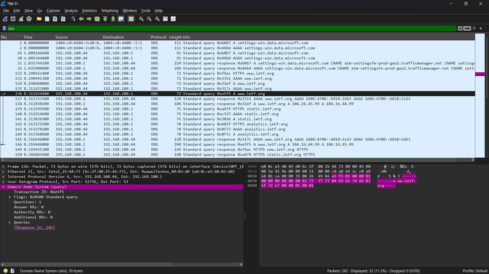
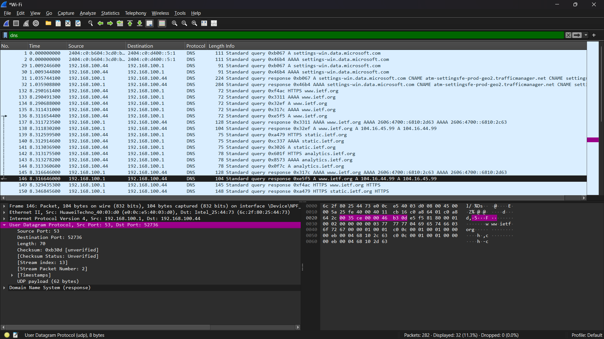
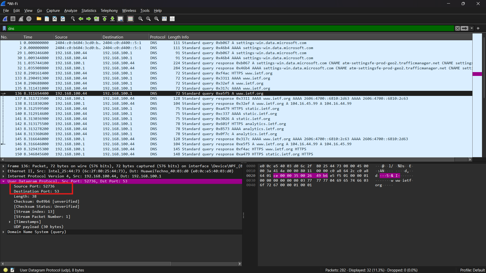
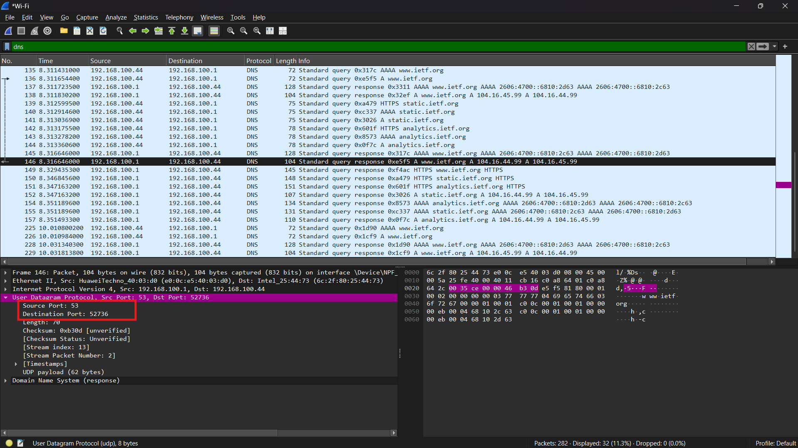
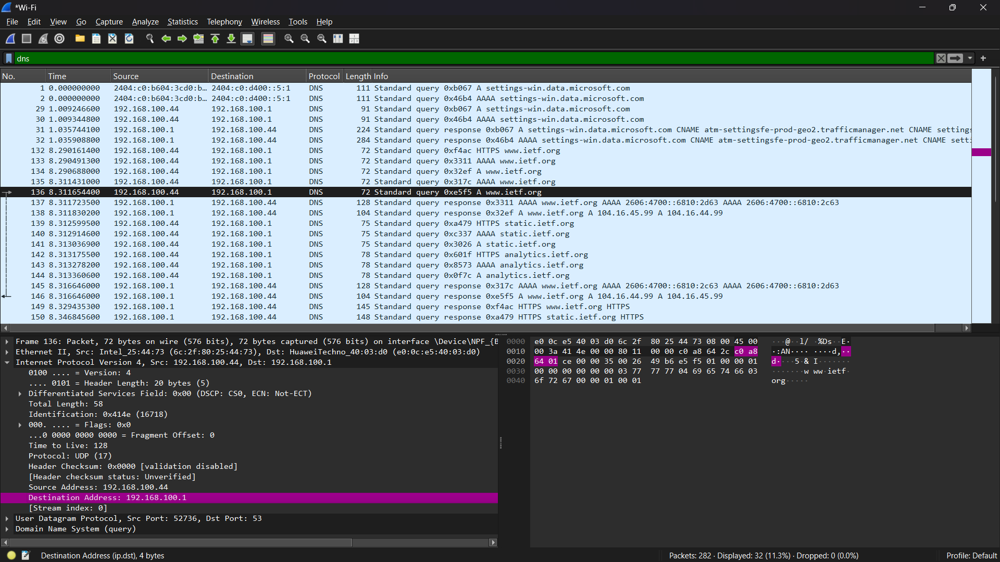
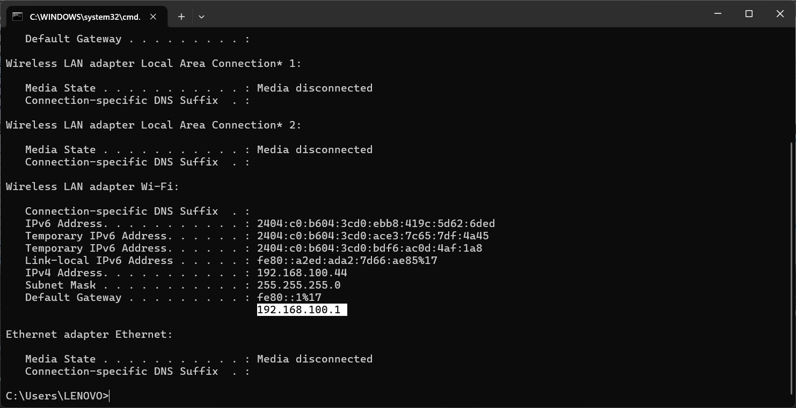
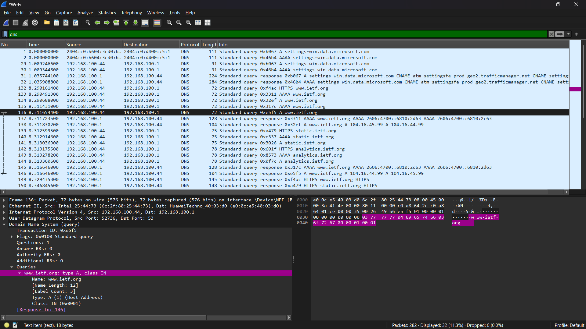
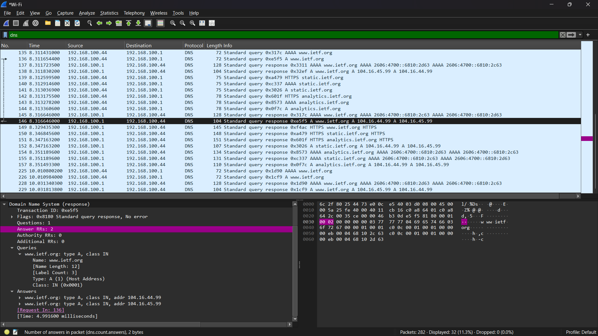

#### Nama : I Wayan Juanesa Ryan Pradita
#### NIM : 103072430012
#### Kelas : IF-04-04
# Pertanyaan

1. Cari pesan permintaan DNS dan balasannya. Apakah pesan tersebut dikirimkan melalui UDP 
atau TCP?
2. Apa port tujuan pada pesan permintaan DNS? Apa port sumber pada pesan balasannya?
3. Pada pesan permintaan DNS, apa alamat IP tujuannya? Apa alamat IP server DNS lokal anda 
(gunakan ipconfig untuk mencari tahu)? Apakah kedua alamat IP tersebut sama?
4. Periksa pesan permintaan DNS. Apa “jenis” atau ”type” dari pesan tersebut? Apakah pesan 
permintaan tersebut mengandung ”jawaban” atau ”answers”?
5. Periksa pesan balasan DNS. Berapa banyak ”jawaban” atau ”answers” yang terdapat di 
dalamnya? Apa saja isi yang terkandung dalam setiap jawaban tersebut?
6. Perhatikan paket TCP SYN yang selanjutnya dikirimkan oleh host Anda. Apakah alamat IP 
pada paket tersebut sesuai dengan alamat IP yang tertera pada pesan balasan DNS?
7. Halaman web yang sebelumnya anda akses (http://www.ietf.org) memuat beberapa 
gambar. Apakah host Anda perlu mengirimkan pesan permintaan DNS baru setiap kali ingin 
mengakses suatu gambar?

# Jawaban

1.

Pesan DNS dikirim melalui UDP

---

2.

Port tujuan pada permintaan DNS adalah 53
Port sumber pada balasan DNS adalah 53

---

3.

Kedua alamat IP tersebut sama

---

4.

Jenis pesan adalah A (Address Record)
Pesan permintaan tidak mengandung jawaban (answers)

---

5.

Jumlah jawaban adalah (biasanya >1)
Isi jawaban berupa alamat IP dari domain yang diminta

---

7. Tidak, host tidak perlu mengirim permintaan DNS baru setiap kali mengakses gambar karena alamat IP sudah disimpan dalam cache DNS

