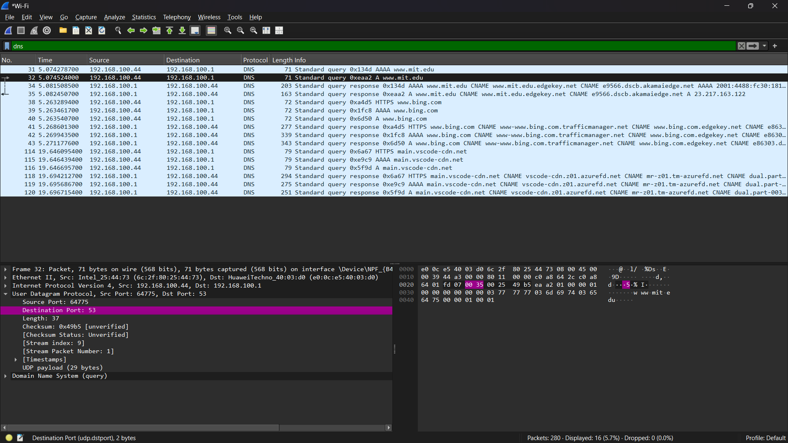
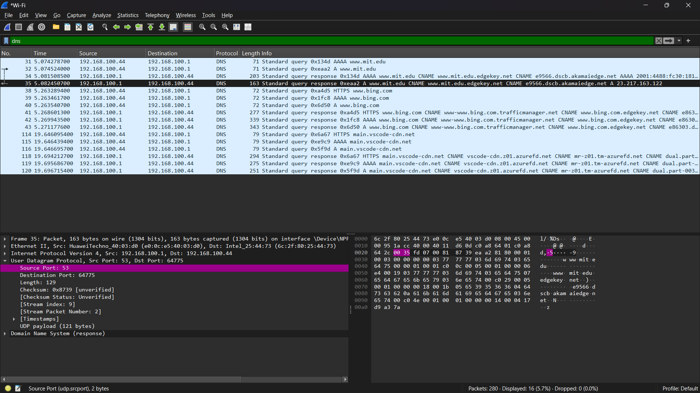
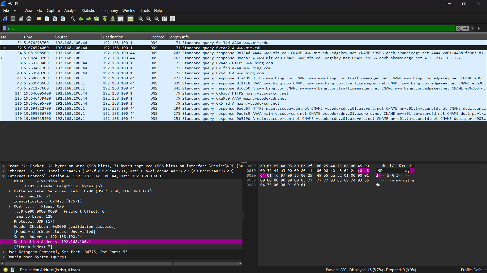
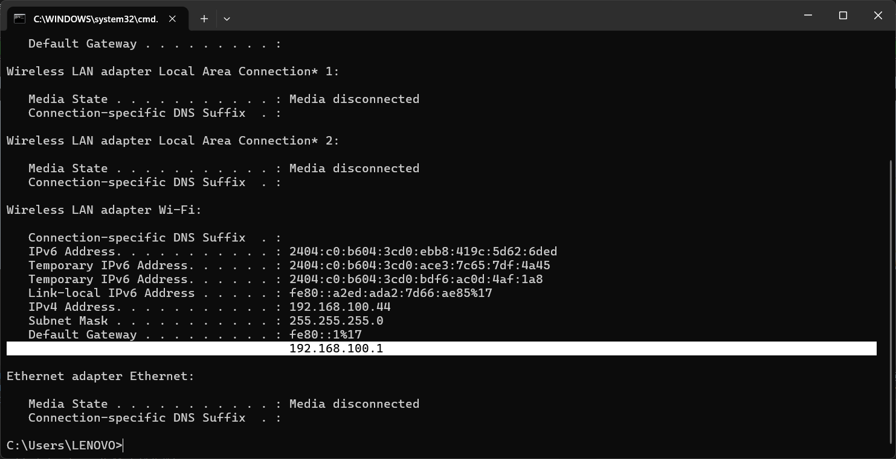
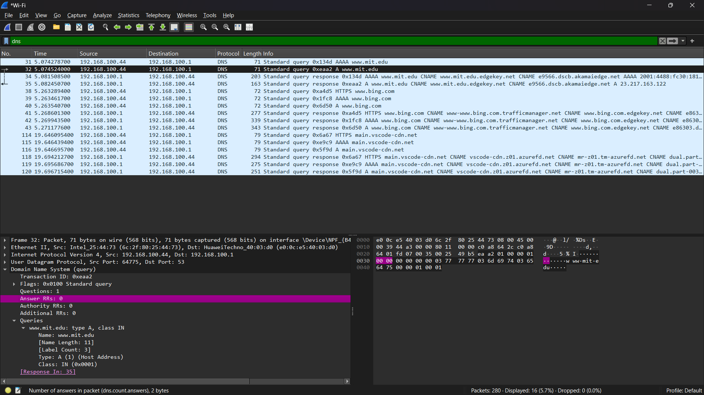
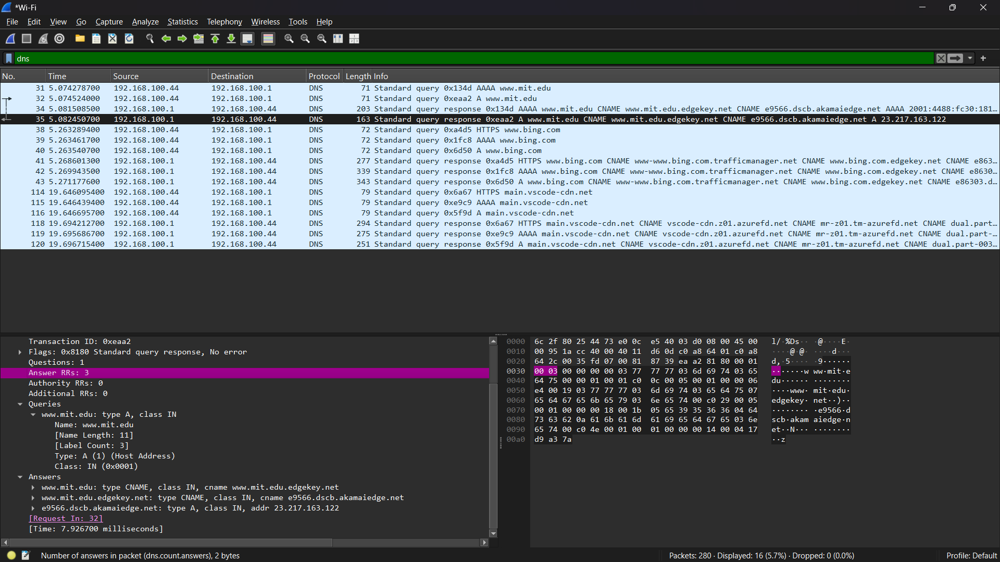

#### Nama : I Wayan Juanesa Ryan Pradita
#### NIM : 103072430012
#### Kelas : IF-04-04
# Pertanyaan

1. Apa port tujuan pada pesan permintaan DNS? Apa port sumber pada pesan balasan DNS?
2. Ke alamat IP manakah pesan permintaan DNS dikirimkan? Apakah alamat IP tersebut 
merupakan default alamat IP server DNS lokal Anda?
3. Periksa pesan permintaan DNS. Apa ”jenis” atau ”type” dari pesan tersebut? Apakah pesan 
tersebut mengandung ”jawaban” atau ”answers”?
4. Periksa pesan balasan DNS. Berapa banyak ”jawaban” atau “answers” yang terdapat di 
dalamnya. Apa saja isi yang terkandung dalam setiap jawaban tersebut?
## perintah nslookup untuk www.mit.edu

# Jawaban

1.

Port tujuan pada permintaan DNS adalah 53, sedangkan port sumber pada balasan DNS adalah 53

---

2.

Pesan permintaan DNS dikirim ke alamat IP 192.168.100.1 dan alamat tersebut merupakan DNS lokal karena sama dengan hasil ipconfig

---

3.

Jenis pesan adalah A (Address Record) dan tidak mengandung jawaban

---

4.

Jumlah jawaban adalah 3 dan berisi alamat IP dari www.mit.edu