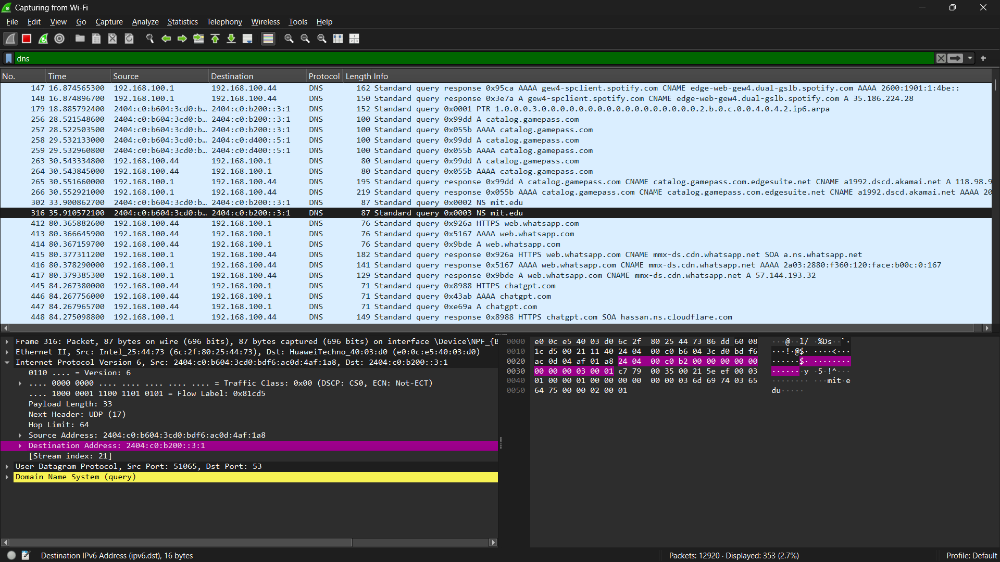
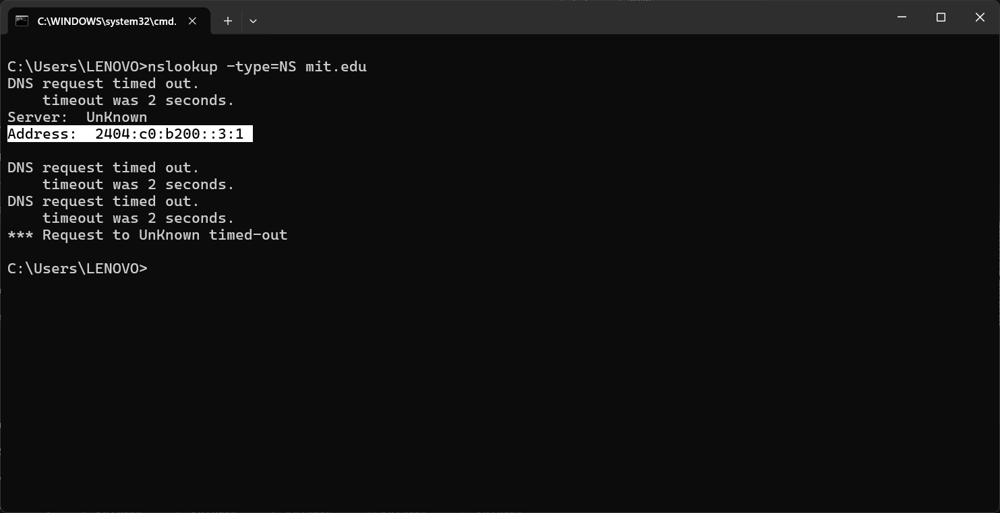
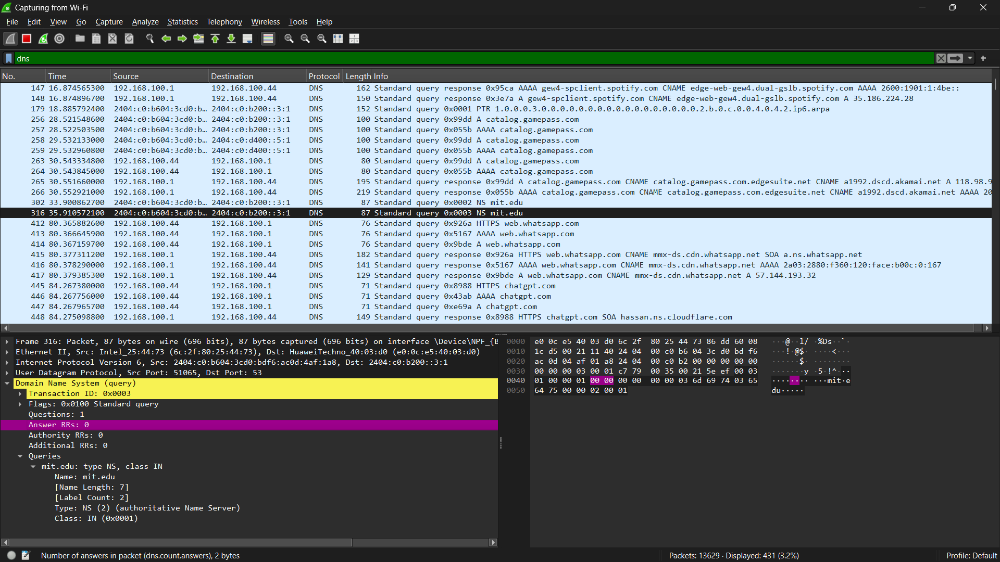

#### Nama : I Wayan Juanesa Ryan Pradita
#### NIM : 103072430012
#### Kelas : IF-04-04
# Pertanyaan

1. Ke alamat IP manakah pesan permintaan DNS dikirimkan? Apakah alamat IP tersebut 
merupakan default alamat IP server DNS lokal Anda?
2. Periksa pesan permintaan DNS. Apa ”jenis” atau ”type” dari pesan tersebut? Apakah pesan 
tersebut mengandung ”jawaban” atau ”answers”?
3. Periksa pesan balasan DNS. Apa nama server MIT yang diberikan oleh pesan balasan? 
Apakah pesan balasan ini juga memberikan alamat IP untuk server MIT tersebut?
## perintah nslookup –type=NS mit.edu

# Jawaban

1.

Pesan permintaan DNS dikirim ke alamat IP 2404:c0:b200::3:1 dan alamat tersebut merupakan DNS lokal karena sama dengan hasil ipconfig.

---

2.

Jenis pesan adalah NS (Name Server) dan tidak mengandung jawaban (answers)

---

3. Paket balasan DNS tidak tertangkap pada Wireshark, kemungkinan karena penggunaan DNS cache atau DNS over HTTPS (DoH). Namun berdasarkan hasil perintah nslookup, nama server MIT yang diperoleh adalah:
ns1.mit.edu
ns2.mit.edu
dan balasan tersebut juga memberikan alamat IP dari server tersebut.
