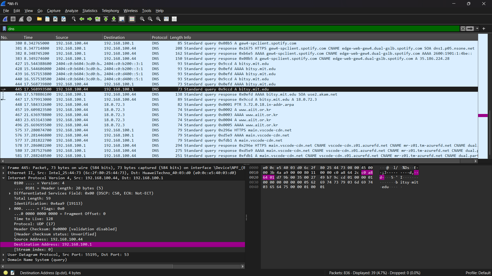
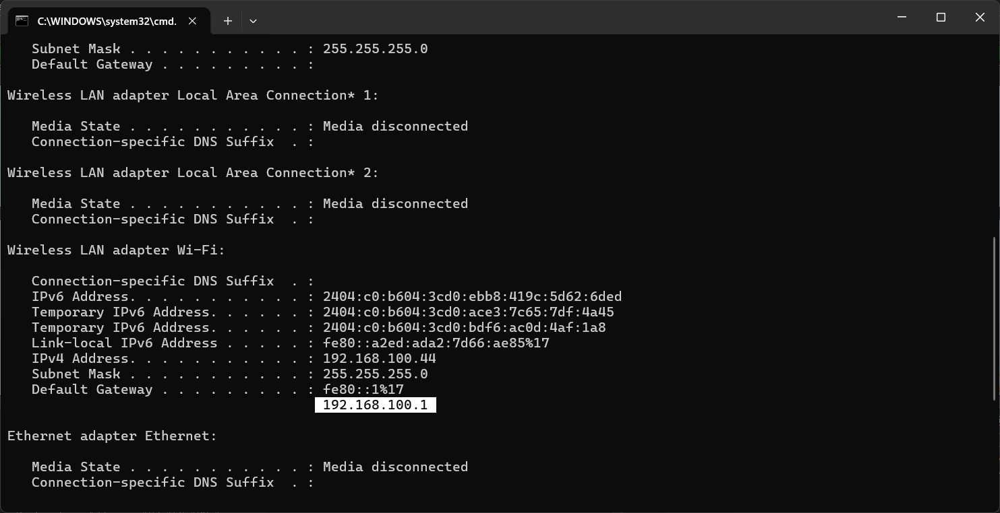
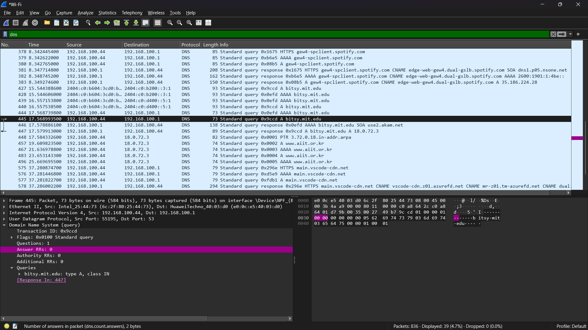
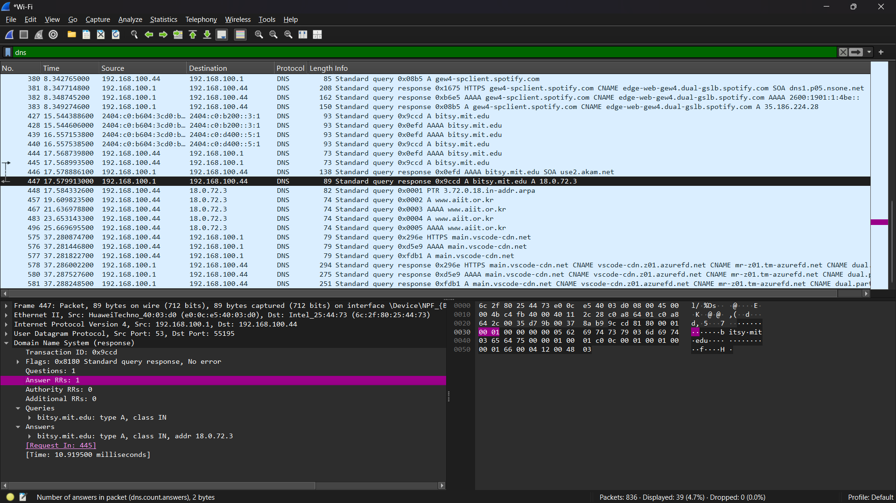

#### Nama : I Wayan Juanesa Ryan Pradita
#### NIM : 103072430012
#### Kelas : IF-04-04
# Pertanyaan

1. Ke alamat IP manakah pesan permintaan DNS dikirimkan? Apakah alamat IP tersebut 
merupakan default alamat IP server DNS lokal Anda?
2. Periksa pesan permintaan DNS. Apa ”jenis” atau ”type” dari pesan tersebut? Apakah pesan 
tersebut mengandung ”jawaban” atau ”answers”?
3. Periksa pesan balasan DNS. Berapa banyak ”jawaban” atau “answers” yang terdapat di 
dalamnya. Apa saja isi yang terkandung dalam setiap jawaban tersebut?
## perintah nslookup www.aiit.or.kr bitsy.mit.edu

# Jawaban

1.

Pesan permintaan DNS dikirim ke alamat IP 18.0.72.3, yang merupakan alamat dari server bitsy.mit.edu. Alamat tersebut bukan merupakan DNS lokal, karena DNS lokal yang digunakan adalah 192.168.100.1.

---

2.

Jenis pesan adalah A (Address Record) dan pesan tersebut tidak mengandung jawaban (answers).

---

3.

Jumlah jawaban adalah 1