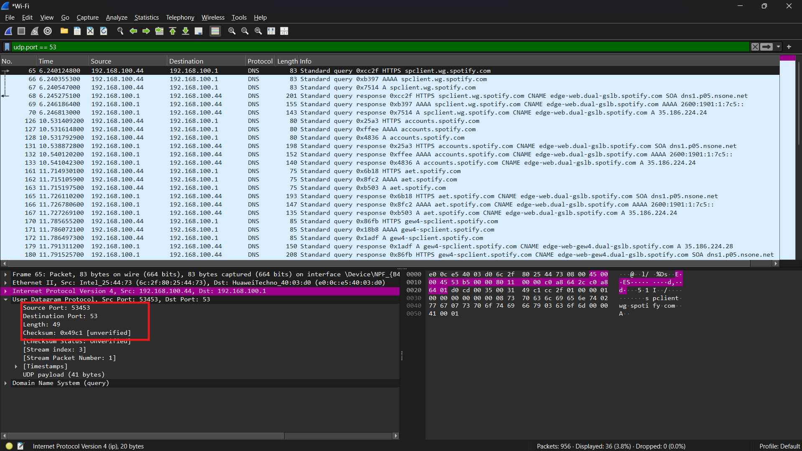
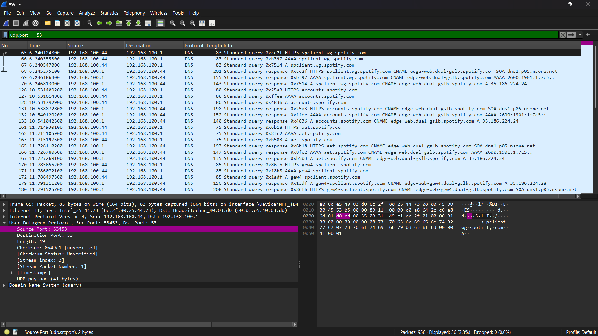
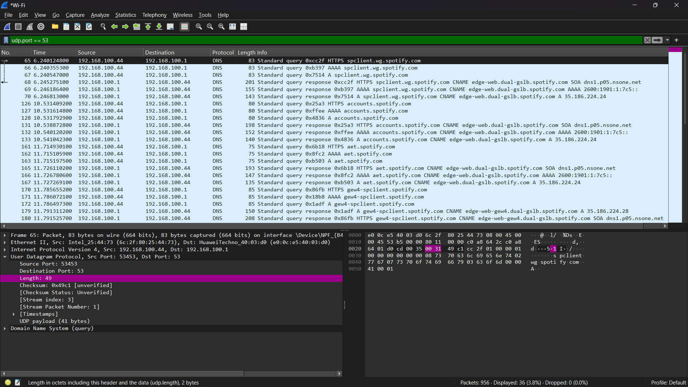
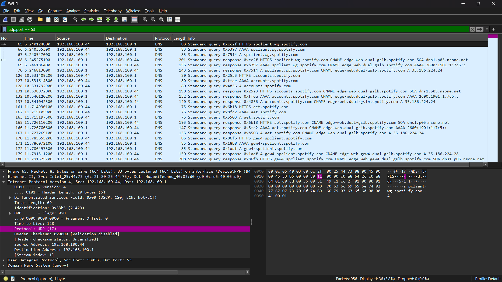
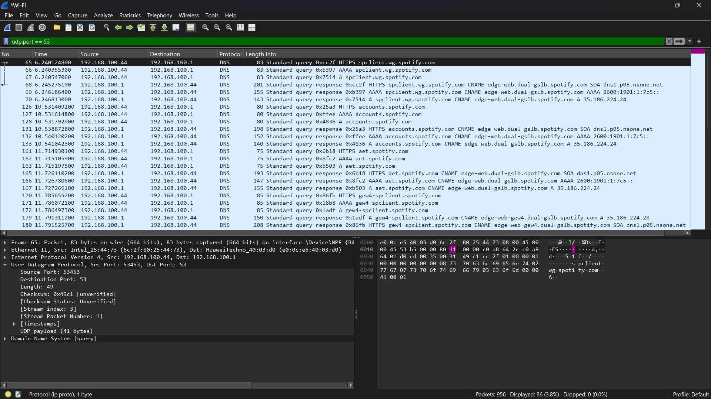
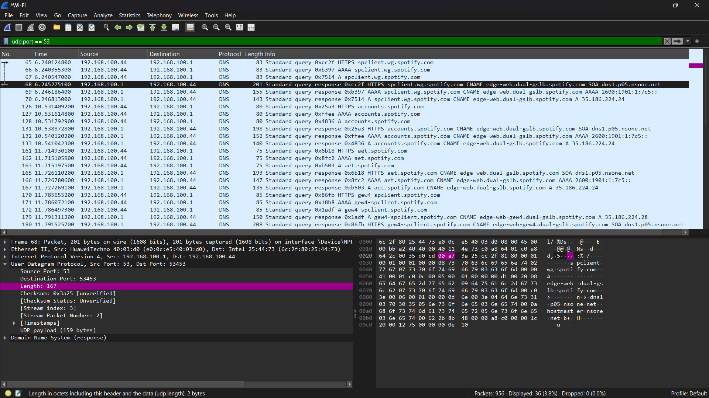

#### Nama : I Wayan Juanesa Ryan Pradita
#### NIM : 103072430012
#### Kelas : IF-04-04
# Pertanyaan

1. Pilih satu paket UDP yang terdapat pada trace Anda. Dari paket tersebut, berapa banyak 
“field” yang terdapat pada header UDP? Sebutkan nama-nama field yang Anda temukan!
2. Perhatikan informasi “content field” pada paket yang Anda pilih di pertanyaan 1. Berapa 
panjang (dalam satuan byte) masing-masing “field” yang terdapat pada header UDP?
3. Nilai yang tertera pada ”Length” menyatakan nilai apa? Verfikasi jawaban Anda melalui 
paket UDP pada trace.
4. Berapa jumlah maksimum byte yang dapat disertakan dalam payload UDP? (Petunjuk: 
jawaban untuk pertanyaan ini dapat ditentukan dari jawaban Anda untuk pertanyaan 2)
5. Berapa nomor port terbesar yang dapat menjadi port sumber? (Petunjuk: lihat petunjuk 
pada pertanyaan 4)
6. Berapa nomor protokol untuk UDP? Berikan jawaban Anda dalam notasi heksadesimal dan 
desimal. Untuk menjawab pertanyaan ini, Anda harus melihat ke bagian ”Protocol” pada 
datagram IP yang mengandung segmen UDP.
7. Periksa pasangan paket UDP di mana host Anda mengirimkan paket UDP pertama dan paket 
UDP kedua merupakan balasan dari paket UDP yang pertama. (Petunjuk: agar paket kedua merupakan balasan dari paket pertama, pengirim paket pertama harus menjadi tujuan dari paket kedua). Jelaskan hubungan antara nomor port pada kedua paket tersebut!

# Jawaban

1.

Dari hasil yang saya dapat, terdapat 4 field pada header UDP, yaitu:
- Source Port
- Destination Port
- Length
- Checksum

---

2.

Dari gambar, panjang masing-masing field adalah:
Source Port = 2 byte
Destination Port = 2 byte
Length = 2 byte
Checksum = 2 byte
Jadi, total header UDP = 8 byte

---

3.

Nilai pada field Length menyatakan total panjang dari segmen UDP yang terdiri dari header dan data (payload). Pada hasil pengamatan diperoleh nilai Length sebesar 49 byte. Karena panjang header UDP adalah 8 byte, maka panjang data (payload) adalah 41 byte (49 - 8). Hal ini sesuai dengan informasi pada Wireshark yang menunjukkan ukuran data dalam paket tersebut.

---

4.

Maksimum ukuran paket IP adalah 65535 byte. Setelah dikurangi header IP sebesar 20 byte, diperoleh ukuran maksimum untuk UDP sebesar 65515 byte. Kemudian dikurangi lagi dengan header UDP sebesar 8 byte, sehingga maksimum payload UDP adalah 65507 byte.
Jadi pada hasil pengamatan yang saya peroleh, diperoleh panjang UDP sebesar 49 byte, sehingga payload yang dibawa adalah 41 byte (49 - 8). Nilai ini jauh lebih kecil dibandingkan dengan ukuran maksimum payload UDP.

---

5. Nomor port terbesar adalah 65535, karena field port pada protokol UDP menggunakan ukuran 16 bit. Dengan 16 bit, jumlah kemungkinan nilai adalah 2^16 = 65536, yang dimulai dari 0 hingga 65535, sehingga nilai maksimum port adalah 65535.

---

6.

Nomor protokol UDP adalah:
Desimal: 17
Heksadesimal: 0x11

---

7.

Pada paket permintaan, source port berasal dari client yaitu 53453 dan destination port menuju server yaitu 53. Pada paket balasan, source port berasal dari server yaitu 53 dan destination port menuju client yaitu 53453. Hal ini menunjukkan bahwa nomor port pada paket balasan merupakan kebalikan dari paket permintaan, sehingga komunikasi dapat kembali ke client yang benar.