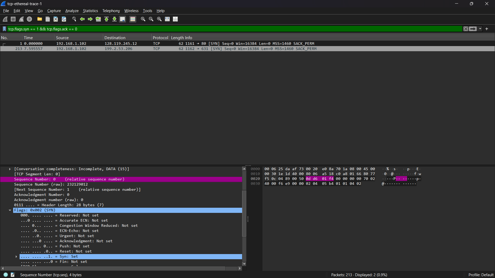
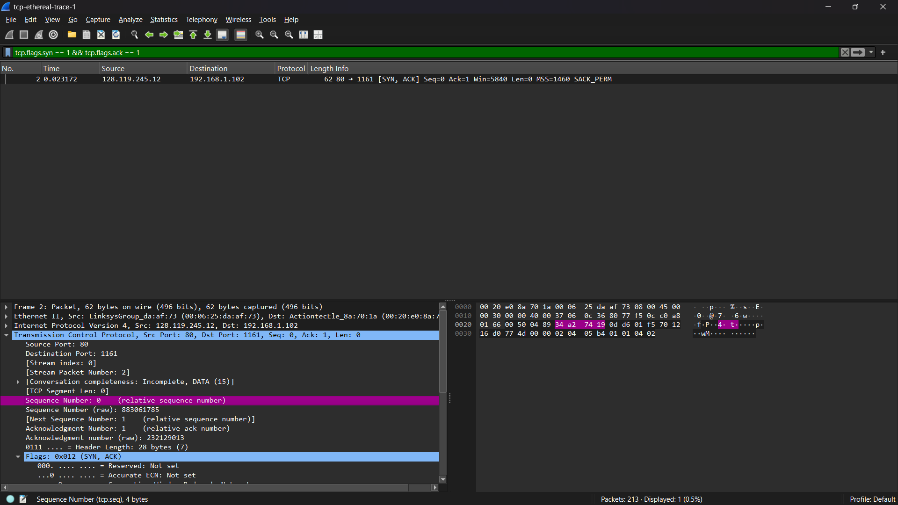
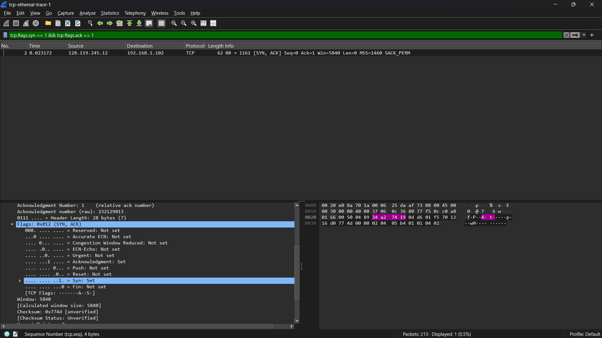
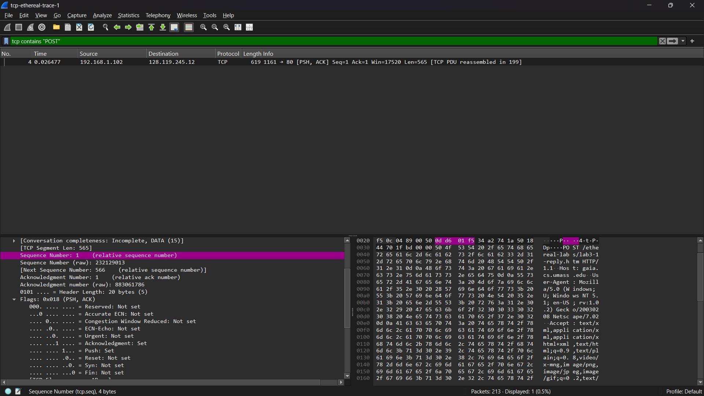
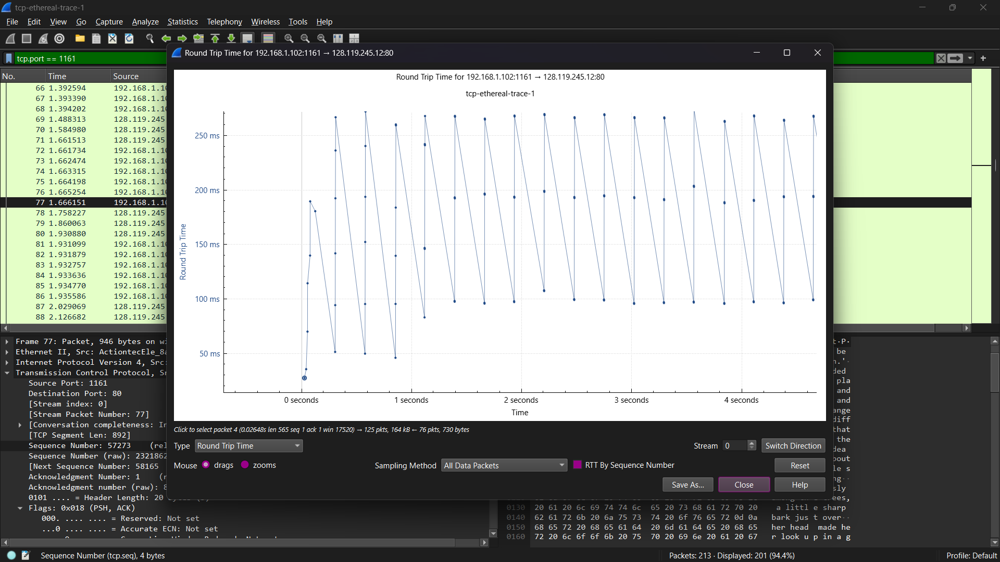
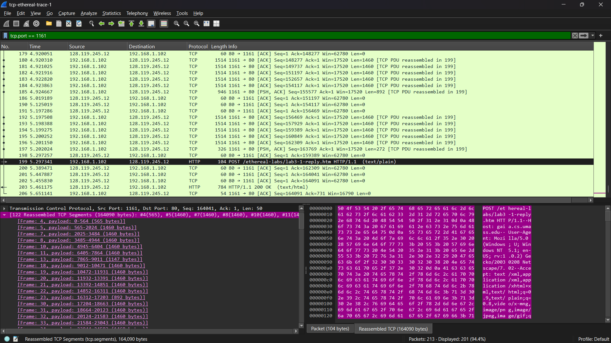
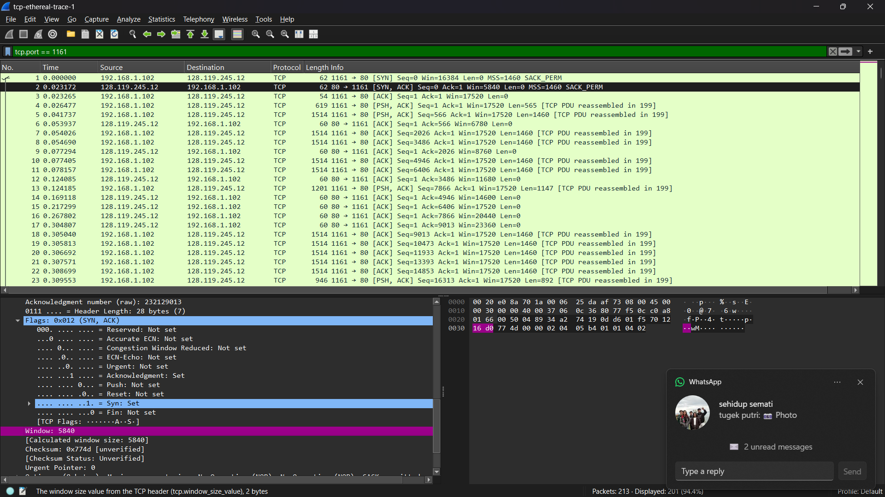
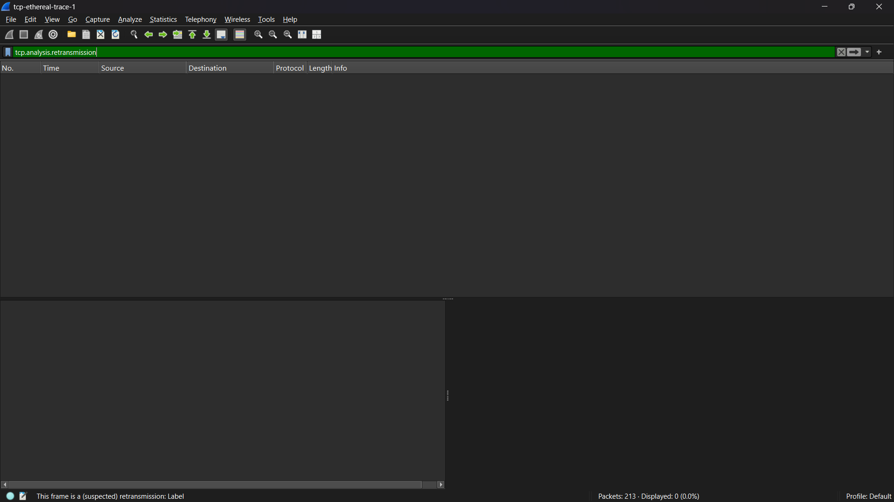
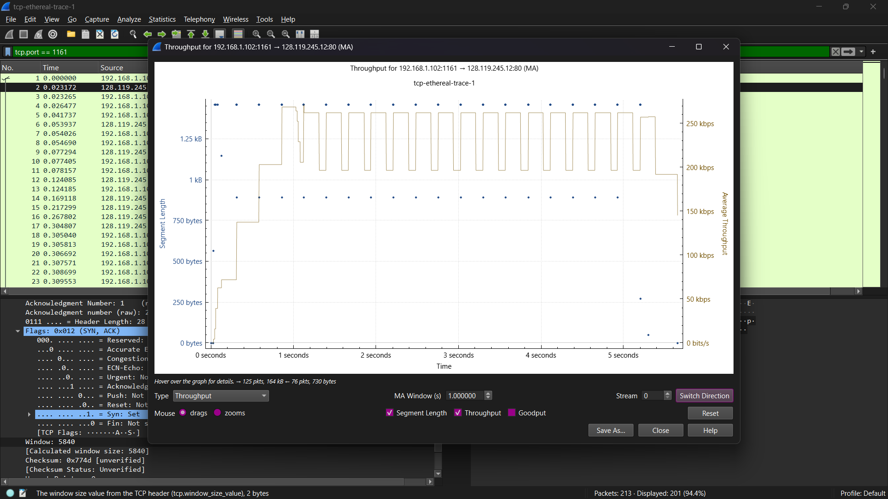
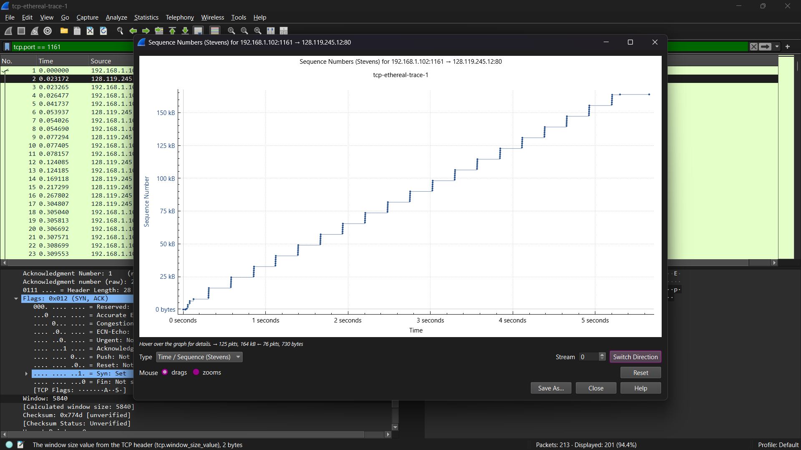

#### Nama   : I Wayan Juanesa Ryan Pradita
#### NIM    : 103072430012
#### Kelas  : IF-04-04
# Pertanyaan

1. Berapa nomor urut segmen TCP SYN yang digunakan untuk memulai sambungan TCP antara komputer klien dan gaia.cs.umass.edu? Apa yang dimiliki segmen tersebut sehingga teridentifikasi sebagai segmen SYN?
2. Berapa nomor urut segmen SYNACK yang dikirim oleh gaia.cs.umass.edu ke komputer klien sebagai balasan dari SYN? Berapa nilai dari field Acknowledgement pada segmen SYNACK? Bagaimana gaia.cs.umass.edu menentukan nilai tersebut? Apa yang dimiliki oleh segmen sehingga teridentifikasi sebagai segmen SYNACK?
3. Berapa nomor urut segmen TCP yang berisi perintah HTTP POST? Perhatikan bahwa untuk menemukan perintah POST, Anda harus menelusuri content field milik paket di bagian bawah jendela Wireshark, kemudian cari segmen yang berisi "POST" di bagian field DATAnya.
4. Anggap segmen TCP yang berisi HTTP POST sebagai segmen pertama dalam koneksi TCP. Berapa nomor urut dari enam segmen pertama dalam TCP (termasuk segmen yang berisi HTTP POST)? Pada jam berapa setiap segmen dikirim? Kapan ACK untuk setiap segmen diterima? Dengan adanya perbedaan antara kapan setiap segmen TCP dikirim dan kapan acknowledgement-nya diterima, berapakah nilai RTT untuk keenam segmen tersebut? Berapa nilai EstimatedRTT setelah penerimaan setiap ACK? (Catatan: Wireshark memiliki fitur yang memungkinkan Anda untuk memplot RTT untuk setiap segmen TCP yang dikirim. Pilih segmen TCP yang dikirim dari klien ke server gaia.cs.umass.edu pada jendela "daftar paket yang ditangkap". Kemudian pilih: Statistics->TCP Stream Graph- >Round Trip Time Graph).
5. Berapa panjang setiap enam segmen TCP pertama?
6. Berapa jumlah minimum ruang buffer tersedia yang disarankan kepada penerima dan diterima untuk seluruh trace? Apakah kurangnya ruang buffer penerima pernah menghambat pengiriman?
7. Apakah ada segmen yang ditransmisikan ulang dalam file trace? Apa yang anda periksa (di dalam file trace) untuk menjawab pertanyaan ini?
8. Berapa banyak data yang biasanya diakui oleh penerima dalam ACK? Dapatkah anda mengidentifikasi kasus-kasus di mana penerima melakukan ACK untuk setiap segmen yang diterima?
9. Berapa throughput (byte yang ditransfer per satuan waktu) untuk sambungan TCP? Jelaskan bagaimana Anda menghitung nilai ini.

# Jawaban

1.

Nomor urut segmen TCP SYN adalah 0 . Segmen ini teridentifikasi sebagai SYN karena memiliki flag SYN = 1 dan ACK = 0.

---

2.

Nomor urut segmen SYNACK adalah 0 dan nilai acknowledgment adalah 1. Nilai acknowledgment diperoleh dari sequence number SYN + 1. Segmen ini teridentifikasi karena memiliki flag SYN = 1 dan ACK = 1.

---

3.

Nomor urut segmen TCP yang berisi HTTP POST adalah 1.

---

4.

Dari hasil yang saya dapatkan,
1. Nomor Urut (Sequence Number) 6 Segmen Pertama
Berdasarkan panel Packet Details (bagian kiri bawah) yang menyorot Frame 77:
- Segmen 1 (HTTP POST): Memiliki nomor urut (Sequence Number) 57273.
- Segmen 2 - 6: Karena panjang segmen data (TCP Segment Len) adalah 892 byte, maka nomor urut berikutnya bertambah sebesar 892 untuk setiap segmen:
- Segmen 2: 58165
- Segmen 3: 59057
- Segmen 4: 59949
- Segmen 5: 60841
- Segmen 6: 61733
2. Waktu Pengiriman dan Penerimaan ACK
- Jam Pengiriman Segmen 1: Tertera pada kolom Time di daftar paket untuk Frame 77, yaitu pada detik 1.666151.
- Jam Pengiriman Segmen 2-6: Jika kita melihat daftar paket di belakang grafik (Frame 72-76), pengiriman terjadi sangat rapat, rata-rata pada detik 1.6661 hingga 1.6662.
- Waktu ACK Diterima: Pada bagian bawah grafik, ada keterangan Click to select packet 4 (0.02648s...). Ini menunjukkan SampleRTT pertama adalah sekitar 0.026 detik. Maka, ACK untuk segmen pertama diterima pada jam 1.692631 (1.666151 + 0.02648).
3. Nilai RTT untuk 6 Segmen Pertama
Berdasarkan plot titik-titik biru di awal grafik (dari kiri ke kanan):
- RTT Segmen 1: 26.48 ms (0.02648 detik, sesuai keterangan di bawah grafik).
- RTT Segmen 2: Sekitar 30 ms (berdasarkan posisi titik kedua di sumbu y).
- RTT Segmen 3: Sekitar 75 ms.
- RTT Segmen 4: Sekitar 125 ms.
- RTT Segmen 5: Sekitar 165 ms.
- RTT Segmen 6: Sekitar 195 ms (mencapai puncak sebelum turun kembali).
4. EstimatedRTT dihitung menggunakan rumus EstimatedRTT = (1 − 0.125) × EstimatedRTT sebelumnya + 0.125 × SampleRTT. Berdasarkan perhitungan, diperoleh nilai EstimatedRTT berturut-turut sebesar 0.02648, 0.02692, 0.03293, 0.04394, 0.05908, dan 0.07606 detik untuk enam segmen pertama.

---

5.

Rincian Panjang Segmen TCP
- Segmen Pertama (Frame 4): Memiliki panjang payload sebesar 565 bytes.
- Segmen Kedua (Frame 5): Memiliki panjang payload sebesar 1460 bytes.
- Segmen Ketiga (Frame 7): Memiliki panjang payload sebesar 1460 bytes.
- Segmen Keempat (Frame 8): Memiliki panjang payload sebesar 1460 bytes.
- Segmen Kelima (Frame 10): Memiliki panjang payload sebesar 1460 bytes.
- Segmen Keenam (Frame 11): Memiliki panjang payload sebesar 1460 bytes.

---

6.

Nilai window size menunjukkan kapasitas buffer penerima. Tidak terlihat adanya hambatan karena buffer tidak penuh.

---

7.

Tidak terdapat retransmission pada file trace yang diamati. Hal ini dibuktikan dengan tidak adanya label “TCP Retransmission” pada paket-paket di Wireshark. Selain itu, tidak ditemukan paket dengan nomor urut (sequence number) yang sama dikirim ulang oleh pengirim.

---

8.

Penerima biasanya mengakui beberapa byte sekaligus. Dalam beberapa kasus, ACK dikirim untuk setiap segmen yang diterima.

---

9.

Grafik menunjukkan pola "tangga" yang cukup stabil, yang mengindikasikan bahwa pengirim (sender) mengirimkan data dalam kelompok-kelompok segmen, kemudian menunggu konfirmasi (ACK) sebelum mengirimkan kelompok data berikutnya. Kemiringan (slope) garis imajiner dari titik awal ke titik akhir secara visual merepresentasikan throughput yang konsisten sebesar kurang lebih 29,8 KB/s.