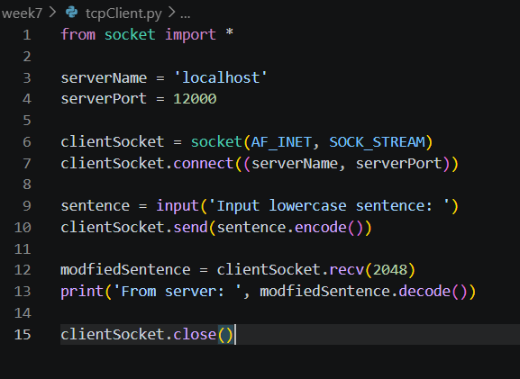
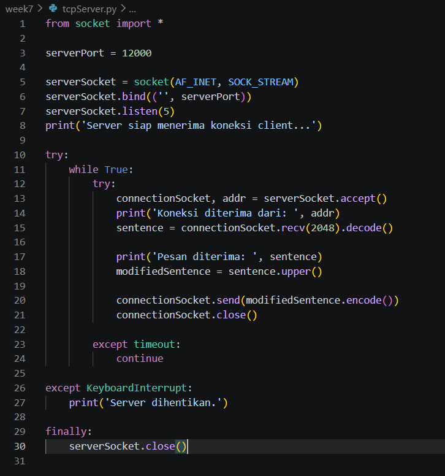
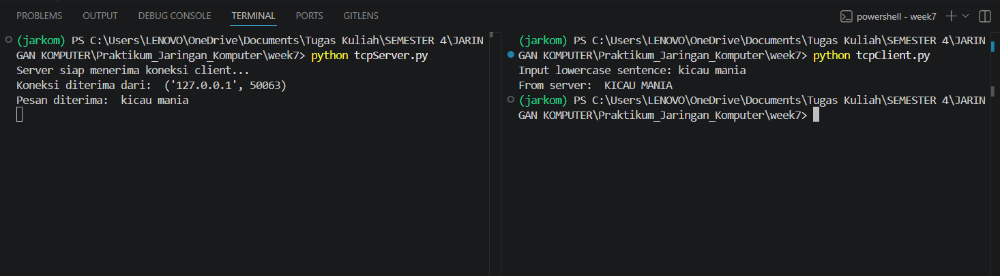

#### Nama   : I Wayan Juanesa Ryan Pradita
#### NIM    : 103072430012
#### Kelas  : IF 04-04

# Analisis Program: TCP Client

Implementasi Socket Programming di sisi client menggunakan protokol TCP (Transmission Control Protocol). Intinya, program ini bertugas buat bikin koneksi ke server, kirim data string, dan nerima balikannya.
1. Setup Library dan Variabel
- from socket import *: Kita import semua fungsi dari library socket.
- serverName & serverPort: Di sini kita nentuin target. localhost artinya kita nembak server di laptop sendiri, dan port 12000 itu ibarat nomor pintu masuk ke aplikasinya.

2. Inisialisasi Socket & Handshaking
- AF_INET & SOCK_STREAM: Ini bagian krusial. AF_INET nandain kita pakai IPv4, dan SOCK_STREAM itu kuncinya TCP. TCP itu sifatnya connection-oriented, jadi harus "kenalan" dulu sebelum kirim data.
- connect(): Di baris ini, si client ngelakuin three-way handshake buat mastiin servernya up dan siap diajak tukar data.

3. Data Transfer
- input(): Kita ambil inputan teks dari user lewat terminal.
- encode(): Data di jaringan itu tidak bisa lewat dalam bentuk teks mentah. Makanya, string tadi diubah dulu jadi byte lewat proses encoding supaya bisa dikirim lewat kabel/udara.

4. Respon Server & Output 
- recv(2048): Fungsi ini bikin client dalam posisi blocking atau nungguin kiriman balik dari server. Angka 2048 itu ukuran buffer-nya (kapasitas maksimal data yang bisa diterima sekali ambil).
- decode(): Kebalikan dari tadi, data byte yang diterima dari server kita "terjemahin" lagi ke string supaya bisa di-print dan dibaca.

5. Terminating Connection 
- close(): Kalau sudah selesai ya harus diputus koneksinya. Tujuannya biar tidak resource leak dan port-nya tidak "nyangkut" (biar bisa dipakai lagi nanti).

### Kesimpulan:
Code ini nunjukkin cara kerja dasar komunikasi client-server. Karena pakai TCP, data dijamin sampai dan urutannya tidak bakal ketuker, beda kalau kita pakai UDP yang sifatnya hit-and-run.

---

# Analisis Program: TCP Server

Kalau tadi client itu yang "nelfon", nah kodingan ini ibarat "operator" yang standby 24/7 buat angkat telfon dan ngasih respon.

1. Inisialisasi Pintu Masuk
- serverPort = 12000: Sama kayak di client, port-nya harus sinkron di angka 12000.
- bind(('', serverPort)): Di sini server "nge-tag" atau mesen port tersebut di OS. Tanda '' artinya server siap nerima koneksi dari IP mana pun yang nembak ke laptop ini.
- listen(5): Baris ini bikin server mode "siaga". Angka 5 itu backlog, maksudnya maksimal ada 5 antrean koneksi yang nunggu sebelum akhirnya ditolak kalau server lagi sibuk.

2. Looping Abadi & Acceptance
- while True: Server harus jalan terus, tidak boleh mati setelah sekali melayani. Makanya dipakein infinite loop.
- accept(): Ini momen krusial. Server bakal berhenti di baris ini (blocking) sampai ada client yang "ngetuk pintu". Pas ada yang masuk, dia bakal dapet dua hal: connectionSocket (jalur khusus buat client itu) dan addr (alamat IP si client).

3. Processing: Nerima & Ngolah Data 
- recv(2048).decode(): Server ngambil data byte dari client terus diterjemahin jadi teks.
- sentence.upper(): Ini "otak" dari aplikasinya. Server nerima string, terus diubah jadi HURUF KAPITAL SEMUA. Simpel, tapi ini nunjukkin kalau server bisa ngelakuin komputasi sebelum dibalikin ke user.
- send(...): Data yang sudah jadi kapital di-encode balik jadi byte terus dikirim ke client lewat jalur khusus tadi.

4. Error Handling 
- connectionSocket.close(): Setelah satu urusan sama satu client beres, jalur khususnya ditutup. Tapi inget, serverSocket yang utama tetep nyala buat nunggu client berikutnya.
- try...except KeyboardInterrupt: Biar kalau kamu mau matiin server (pake Ctrl+C), programnya tidak crash berantakan, tapi keluar dengan sopan dan nampilin pesan "Server dihentikan".
- finally: Mastiin socket utama bener-bener ditutup pas program berhenti total biar port-nya tidak "nyangkut" di sistem.

### Kesimpulan:
Server ini sifatnya iterative, artinya dia melayani client satu-satu secara bergantian dalam sebuah loop. Inti dari interaksinya adalah menerima input kecil, mengubahnya menjadi uppercase, dan mengembalikan hasilnya sebagai output ke client.

---

# OUTPUT

---

# MEKANISME CARA KERJA
1. Sinkronisasi Port (Pintu yang Sama)

serverPort = 12000

- Sisi Server: Dia buka pintu nomor 12000 dan nunggu di situ (bind).
- Sisi Client: Dia ngetuk pintu nomor 12000 (connect).
- Logikanya: Kalau server buka di port 12000 tapi client nembak ke 12001, koneksi bakal refused karena tidak ada yang nunggu di situ.

2. Protokol Harus Searah (TCP vs TCP)
Parameter di fungsi socket():

SOCK_STREAM

- Keduanya pakai SOCK_STREAM. Ini artinya mereka sepakat pakai bahasa TCP.
- TCP itu ibarat telfonan: harus ada konfirmasi "Halo?" "Iya halo" baru data dikirim. Kalau salah satu pakai SOCK_DGRAM (UDP), mereka tidak bakal nyambung karena "frekuensi" komunikasinya beda.

3. Alamat IP (Localhost)
Di sisi Client, ada variabel:

serverName = 'localhost'

- localhost (atau IP 127.0.0.1) itu cara client bilang: "Saya mau nyambung ke server yang ada di laptop ini juga".
- Di sisi Server, bind(('', serverPort)) artinya dia siap nerima kiriman dari alamat manapun, termasuk dari si localhost tadi.

### Ilustrasi Proses:
1. Server jalan duluan, dia nongkrong di Port 12000 sambil bilang listen().
2. Client jalan, dia nyari IP localhost dan ngetuk Port 12000.
3. Server ngerasa ada ketukan, dia eksekusi accept(), terus lahirlah connectionSocket.
4. connectionSocket inilah "jembatan" yang bener-bener bikin mereka saling nyambung buat tukar-menukar data (kirim encode dan terima decode).