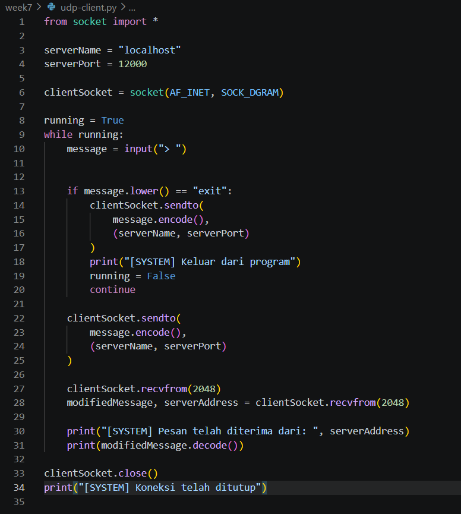
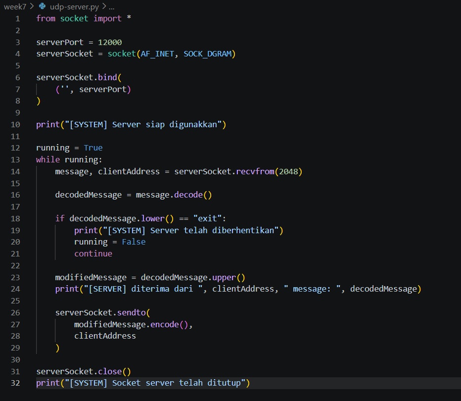
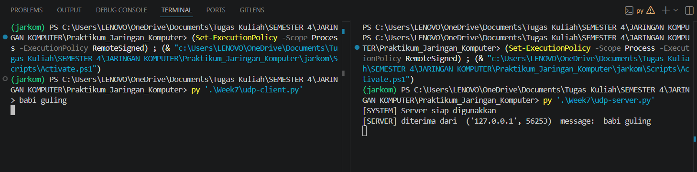

#### Nama   : I Wayan Juanesa Ryan Pradita
#### NIM    : 103072430012
#### Kelas  : IF 04-04

# Analisis Program: UDP Client

Perbedaannya kelihatan dari cara ngirim data. UDP itu sifatnya connectionless, alias tidak pakai acara (connect) di awal.
1. Ganti Aliran ke UDP
- SOCK_DGRAM: Ini kuncinya. Kalau TCP tadi pakai SOCK_STREAM, UDP pakai SOCK_DGRAM (Datagram). Artinya, data dikirim per paket secara independen.

2. Looping Interaktif
- Berbeda dari kodingan sebelumnya yang cuma sekali jalan, di sini pakai while running:. Jadi client bisa kirim pesan berkali-kali tanpa harus buka-tutup aplikasi.
- Fitur Exit: Ada logika if message.lower() == "exit". Ini buat user experience, jadi kalau user ngetik "exit", program bakal pamit ke server terus memutus perulangan.

3. Cara Kirim yang Beda: sendto 
- fungsi: sendto().
- Karena tidak ada koneksi tetap (connect), setiap kali mau kirim pesan, si Client harus selalu nyebutin alamat tujuannya: (serverName, serverPort). Ibarat kirim surat, harus selalu nulis alamat di amplopnya tiap kali mau kirim.

4. Menerima Balasan: recvfrom
- recvfrom(2048): Di sini uniknya UDP. Pas nerima balasan, kita tidak cuma dapet datanya, tapi juga otomatis dapet serverAddress (info siapa yang ngirim balik paket itu).

### Kesimpulan:
Codingan ini nunjukkin sisi efisiensi. UDP cocok banget kalau mau bikin aplikasi yang butuh speed tinggi (seperti game online atau streaming), di mana kalau ada satu-dua paket yang hilang itu tidak masalah asalkan tidak lag.

---

# Analisis Program: UDP Server

Server ini tugasnya standby, nerima paket "anonim", ngolah jadi huruf kapital, terus dibalikin ke pengirimnya.
1. Setup Tanpa Antrean
- SOCK_DGRAM: Sama seperti client-nya, server ini pakai protokol UDP.
- bind(('', serverPort)): Server memesan port 12000. Bedanya sama TCP, di sini tidak ada fungsi listen(). Kenapa? Karena UDP tidak peduli sama antrean koneksi. Dia cuma nunggu paket data datang satu-persatu seperti kotak pos.

2. Menerima Paket & Info Pengirim
- recvfrom(2048): Baris ini sakti. Selain dapet isinya (message), server juga otomatis dapet clientAddress (alamat IP dan Port si pengirim).
- Info clientAddress ini penting banget, karena tanpa ini, server tidak bakal tahu harus kirim balik balasannya ke mana (ingat, UDP itu connectionless atau tidak punya jalur tetap).

3. Logika "Self-Destruct"
- Ada fitur keren di sini: kalau server nerima kata "exit" dari client, variabel running jadi False.
- Ini cara halus buat matiin server dari jarak jauh lewat client. Begitu dapet perintah "exit", server bakal keluar dari perulangan (loop).

4. Processing & Quick Response
- upper(): Sama seperti server TCP, kerjanya cuma mengubah teks jadi huruf kapital.
- sendto(..., clientAddress): Inilah cara UDP membalas. Server tidak cuma kirim data, tapi harus nempelin lagi alamat clientAddress yang didapet di baris 14 tadi pada "amplop" paketnya.

5. Closing 
- close(): Menutup socket utama setelah server berhenti beroperasi agar port 12000 dilepaskan kembali ke sistem operasi.

### Kesimpulan:
Server UDP ini sangat efisien untuk menangani banyak request kecil secara cepat. Kelemahannya, kalau ada paket yang "nyasar" atau hilang di jalan, server tidak bakal tahu dan tidak bakal minta kirim ulang. Tapi buat aplikasi yang butuh respon instan.

---

# OUTPUT

---

# MEKANISME
Sama seperti versi TCP sebelumnya, ada "kontrak" yang harus disepakati antara Client dan Server UDP supaya mereka bisa nyambung. Tapi, karena UDP itu sifatnya connectionless (tidak pake jabat tangan), cara nyambungnya lebih ke arah "lempar-tangkap" paket.
1. Kesamaan Nomor Port (Pintu Utama)
Keduanya kompak menggunakan variabel:

serverPort = 12000

- Server: Dia "buka toko" dan nunggu kiriman paket di port 12000 (bind).
- Client: Pda saat kirim pesan, dia harus nulis di alamat tujuannya kalau paket ini buat port 12000. Kalau client kirim ke port lain, server tidak bakal pernah nerima paket itu karena dia tidak nunggu di sana.

2. Tipe Socket yang Match (UDP Protokol)
Perhatikan baris pembuatan socketnya:

SOCK_DGRAM

Keduanya harus pakai SOCK_DGRAM. Ini ibarat mereka sepakat pakai jasa kurir yang sama. Kalau client pakai SOCK_DGRAM (UDP) tapi server nunggu pakai SOCK_STREAM (TCP), paketnya tidak bakal bisa diproses karena format pembungkusan datanya beda total.

3. Alamat IP dan Variabel clientAddress
Ini bagian paling krusial di UDP yang buat mereka "balas-balasan":
- Client ke Server: Client nembak langsung ke 'localhost' (IP komputer sendiri).
- Server ke Client: Server tidak tahu alamat client sampai paket pertama datang. Pas server eksekusi:
message, clientAddress = serverSocket.recvfrom(2048)
Si server otomatis "nyatet" alamat dan port si pengirim ke dalam variabel clientAddress.
- Balasannya: Pas server mau kirim balik, dia pakai variabel itu lagi di serverSocket.sendto(..., clientAddress). Jadi mereka nyambung karena server "mengingat" alamat pengirim terakhir.

### Perbedaan TCP vs UDP 
- Di TCP: Mereka nyambung lewat "Terowongan" (connect). Sekali terhubung, data tinggal alirkan saja.
- Di UDP: Mereka nyambung lewat "Alamat di Amplop" (sendto & recvfrom). Setiap kirim data, alamat harus selalu ditulis ulang.
Intinya: Mereka nyambung karena Port-nya sama (12000), Jenisnya sama (DGRAM), dan server menangkap alamat pengirim buat kirim balik hasilnya.