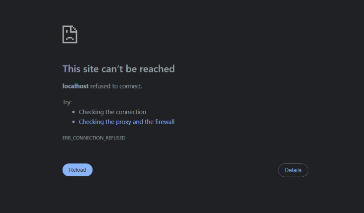
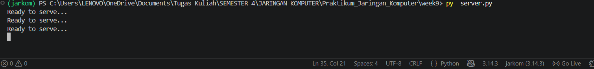
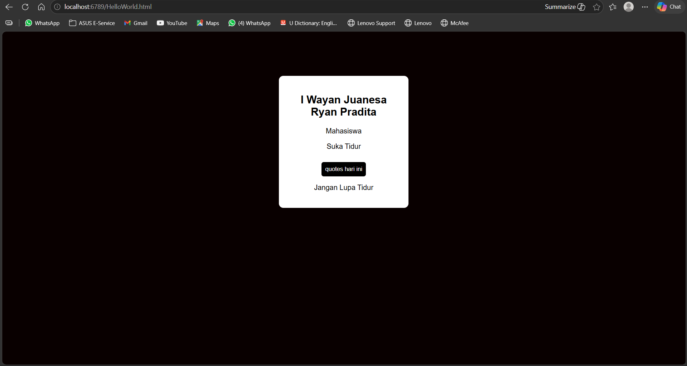
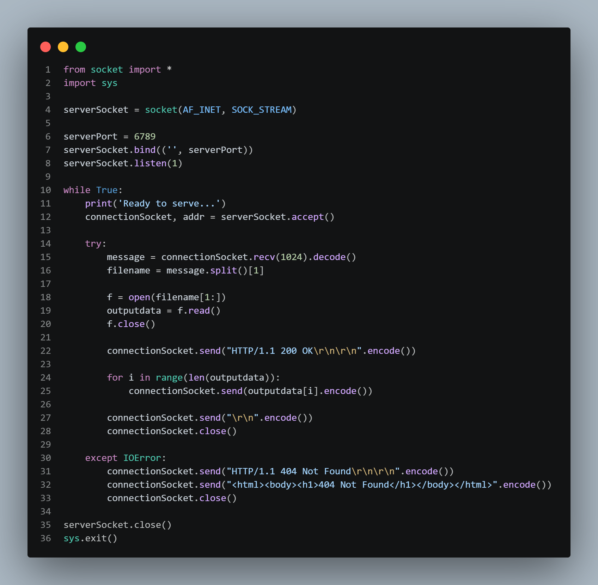

#### Nama : I Wayan Juanesa Ryan Pradita
#### NIM : 103072430012
#### Kelas : IF-04-04

Sebelum dijalankan:

Setelah dijalankan:

kode:

# Penjelasan:

1. Import Library
Pada bagian ini program mengimpor library socket untuk melakukan komunikasi jaringan menggunakan protokol TCP/IP, serta library sys yang digunakan untuk mengakhiri program jika diperlukan.

2. Membuat Socket Server
Program membuat sebuah socket server menggunakan IPv4 (AF_INET) dan protokol TCP (SOCK_STREAM). Socket ini berfungsi sebagai media komunikasi antara server dan client.

3. Menentukan Port
Program menentukan nomor port yang akan digunakan server, yaitu port 6789. Port ini menjadi alamat tujuan yang digunakan client untuk terhubung ke server.

4. Bind ke Port
Server menghubungkan (bind) socket ke port yang telah ditentukan. Dengan demikian server siap menerima koneksi yang masuk melalui port tersebut.

5. Menunggu Koneksi
Fungsi listen() digunakan agar server mulai mendengarkan dan menunggu permintaan koneksi dari client.

6. Loop Server
Perulangan while True membuat server tetap berjalan secara terus-menerus sehingga dapat melayani banyak permintaan client tanpa harus dijalankan ulang.

7. Menampilkan Status Server
Program menampilkan pesan "Ready to serve..." sebagai tanda bahwa server telah aktif dan siap menerima koneksi dari client.

8. Menerima Koneksi Client
Fungsi accept() digunakan untuk menerima koneksi yang masuk dari client. Setelah koneksi diterima, server akan membuat socket baru khusus untuk berkomunikasi dengan client tersebut.

9. Menerima Request HTTP
Server menerima data yang dikirimkan oleh browser menggunakan fungsi recv(). Data yang diterima berupa request HTTP yang berisi informasi halaman yang diminta oleh pengguna.

10. Mengambil Nama File
Program memproses request HTTP untuk mengambil nama file yang diminta oleh browser, misalnya index.html.

11. Membuka File HTML
Setelah nama file diperoleh, server mencoba membuka file tersebut dari direktori tempat program dijalankan.

12. Membaca Isi File
Isi file HTML dibaca dan disimpan ke dalam variabel sehingga dapat dikirimkan kembali kepada browser.

13. Menutup File
Setelah proses pembacaan selesai, file ditutup untuk menghemat penggunaan sumber daya sistem.

14. Mengirim Header HTTP
Server mengirimkan header HTTP dengan status 200 OK sebagai tanda bahwa permintaan client berhasil diproses.

15. Mengirim Isi HTML
Setelah header dikirim, server mengirimkan isi file HTML ke browser sehingga browser dapat menampilkan halaman web yang diminta.

16. Mengakhiri Response
Program mengirim karakter akhir (\r\n) sebagai penanda bahwa proses pengiriman data telah selesai.

17. Menutup Koneksi
Setelah seluruh data berhasil dikirim, koneksi antara server dan client ditutup untuk mengakhiri sesi komunikasi.

18. Browser Merender HTML
Browser menerima file HTML yang dikirim oleh server, kemudian menerjemahkan dan menampilkannya sebagai halaman web yang dapat dilihat pengguna.

19. Menangani Error 404
Jika file yang diminta tidak ditemukan, program akan masuk ke blok except dan mengirimkan status 404 Not Found kepada browser.

20. Mengirim Halaman Error
Server mengirimkan halaman HTML sederhana yang berisi pesan "404 Not Found" sehingga pengguna mengetahui bahwa file yang diminta tidak tersedia pada server.
