# WEEK 1
# Instalasi dan Konfigurasi Dasar Software Network Analyzer Wireshark

## Download Wireshark:
1. Buka situs resmi wireshark.org/download.html di browser, lalu download installer Wireshark versi Windows x64.

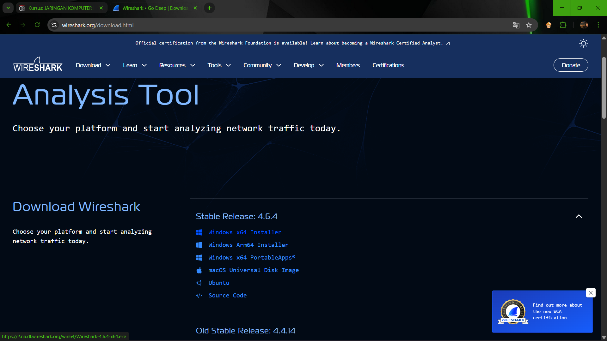

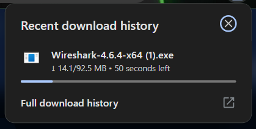

## Menjalankan File:
2. Buka file .exe yang sudah selesai diunduh. Jika muncul notifikasi Microsoft Defender SmartScreen, klik tombol "Run" untuk melanjutkan.

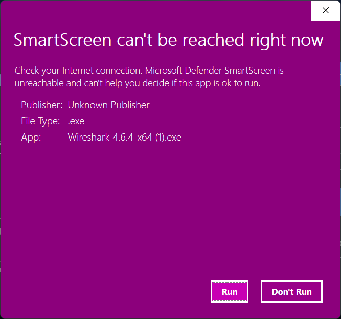

## Setup Wireshark:
3. Setelah setup wireshark terbuka, klik "Next" untuk memulai proses instalasi.

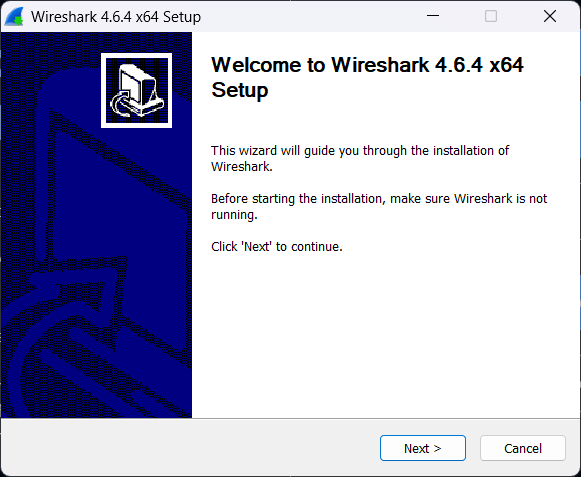

## Informasi Sertifikasi:
4. Pada halaman informasi mengenai Wireshark Certified Analyst (WCA), klik "Next" saja untuk lanjut ke tahap berikutnya.

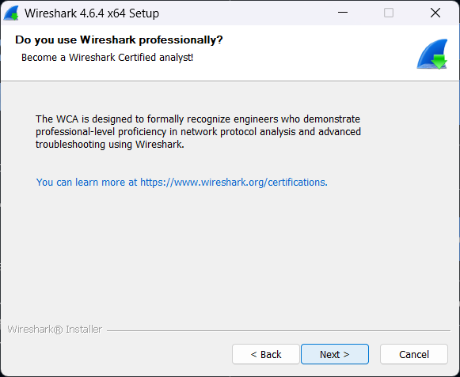

## Menentukan Lokasi Instalasi:
5. Pilih folder tujuan instalasi. Secara default aplikasi akan terinstal di C:\Program Files\Wireshark. Pastikan space hardisk cukup, lalu klik "Next".

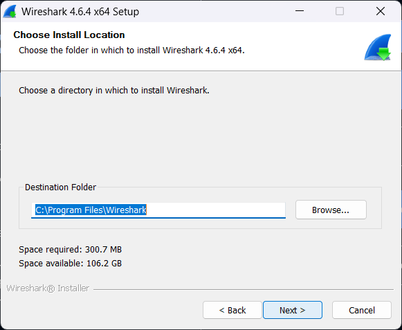

## Proses Instalasi:
6. Tunggu proses ekstraksi file dan instalasi background (seperti Visual C++ Redistributable) sampai bar progres terisi penuh.

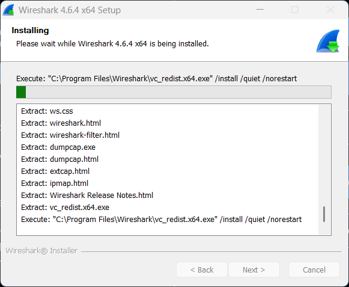

## Selesai Instalasi:
7. Setelah instalasi selesai (Completed), klik "Next" lalu klik "Finish" untuk menutup wizard.

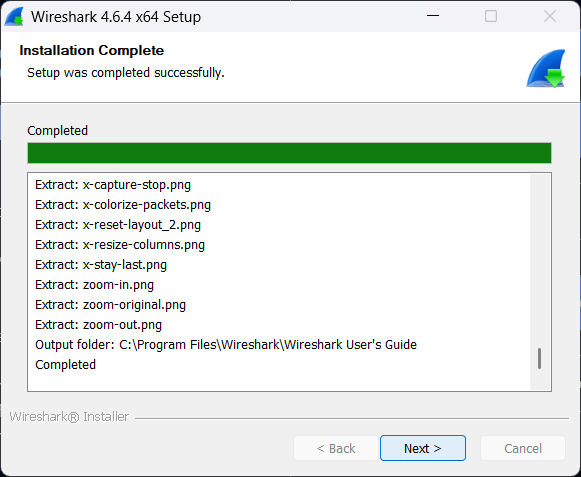

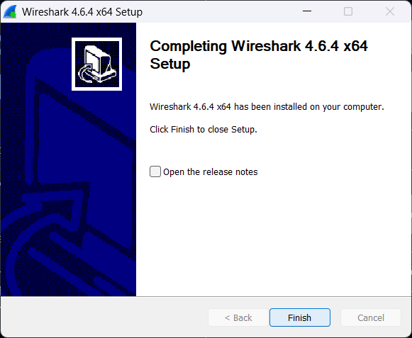

## Verifikasi:
8. Buka menu Start Windows dan cari "Wireshark". Jika aplikasi muncul di hasil pencarian, artinya Wireshark sudah berhasil terinstal dan siap digunakan.

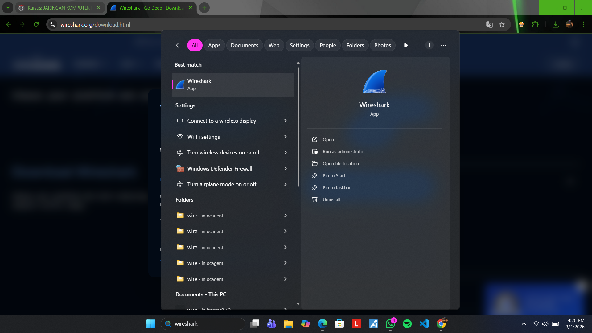

## Pemilihan Interface Jaringan:
1. Saat membuka aplikasi, pilih interface yang aktif untuk menangkap paket. Pada percobaan ini, interface "Wi-Fi" dipilih karena perangkat menggunakan koneksi nirkabel.

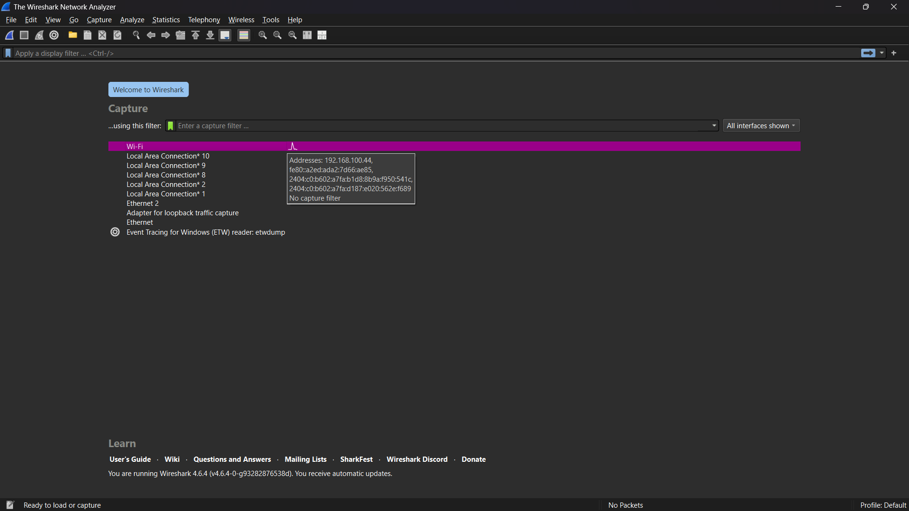

## Memulai Proses Capture:
2. Klik tombol Start (ikon sirip hiu) untuk memulai proses perekaman trafik. Wireshark akan mulai menampilkan paket data yang lewat secara real-time.

> klik stop
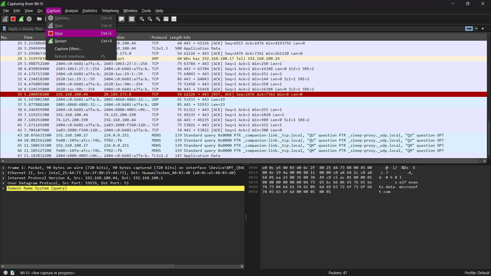

> klik option
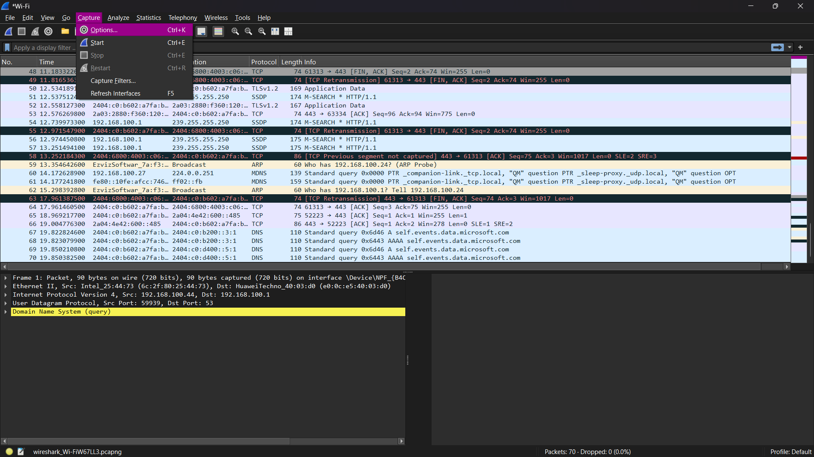

> klik start
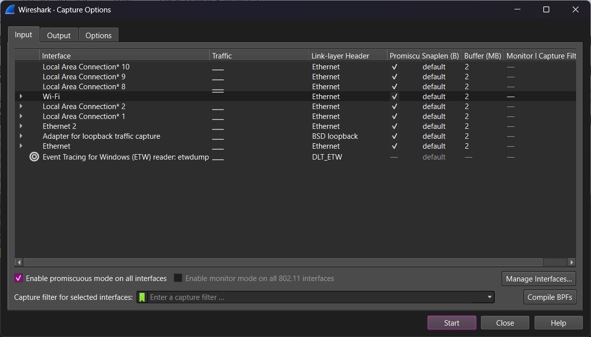

> klik bagian tengah 
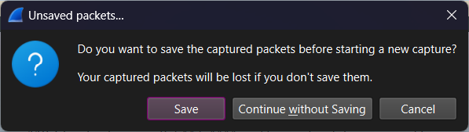

## Akses Materi Praktikum:
3. Untuk menghasilkan trafik HTTP, buka web browser dan akses URL materi praktikum di gaia.cs.umass.edu/wireshark-labs/INTRO-wireshark-file1.html.

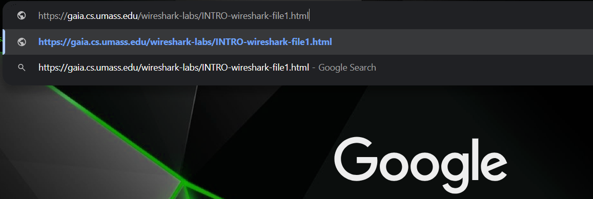

4. Setelah halaman dimuat, Anda akan melihat pesan konfirmasi bahwa file lab telah terunduh.

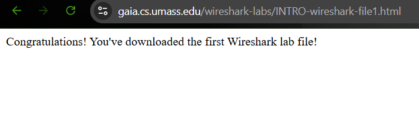

## Filter Paket:
5. Untuk mempermudah analisis, gunakan kolom display filter di bagian atas.
6. Ketikkan filter (misalnya "http") untuk menyaring tampilan agar hanya menunjukkan paket dengan protokol HTTP saja, sehingga paket data yang relevan lebih mudah diamati.

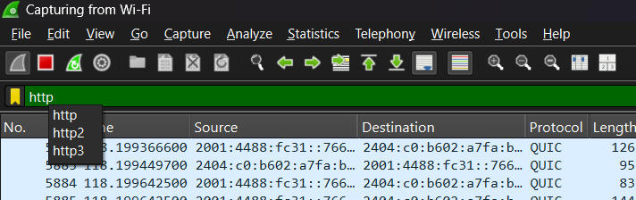

## Hasil:
7. Berdasarkan hasil capture menggunakan Wireshark, terlihat proses komunikasi HTTP antara client dan server yang terdiri dari HTTP Request (GET) dan HTTP Response (200 OK). File HTML berhasil dikirim dan isi konten dapat dianalisis karena protokol HTTP tidak menggunakan enkripsi.

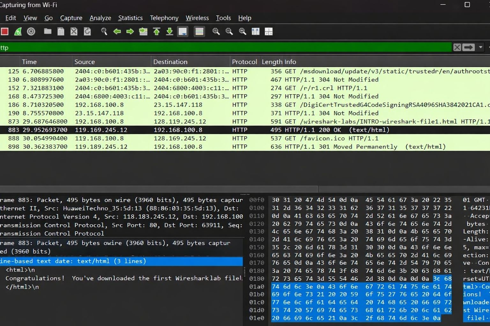

