# WEEK 3
# HTTP (Hypertext Transfer Protocol)

## Penjelasan Umum
HTTP merupakan protokol komunikasi utama yang digunakan dalam proses pertukaran data di web antara client (biasanya browser) dan server. Konsep dasar dari HTTP adalah request dan response, di mana client akan mengirim permintaan terhadap suatu resource, lalu server akan memberikan respon sesuai dengan permintaan tersebut.

HTTP sendiri berjalan di atas protokol TCP, sehingga dalam pengirimannya tetap mengikuti mekanisme TCP seperti pembentukan koneksi, pengiriman data, hingga proses reassembly jika data dikirim dalam beberapa bagian. Dari hasil praktikum menggunakan Wireshark, kita bisa melihat secara langsung bagaimana proses komunikasi ini terjadi di jaringan.

## 1. Basic HTTP GET / Response Interaction
Pada percobaan pertama, dilakukan akses terhadap file HTML sederhana yang tidak memiliki objek tambahan seperti gambar atau file eksternal lainnya.
Langkah-langkah:
~ Membuka browser
~ Menjalankan Wireshark dan mengaktifkan filter http
~ Mengakses URL yang sudah ditentukan
~ Menghentikan proses capture setelah halaman termuat
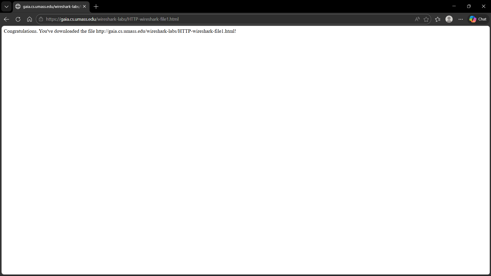
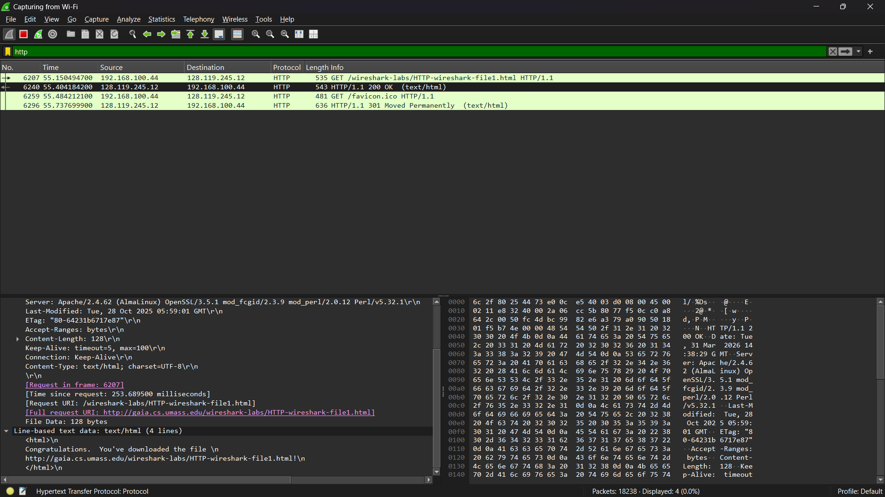
Hasil Pengamatan:
> Dari hasil capture terlihat bahwa:
    ~ Client mengirimkan HTTP GET request ke server
    ~ Server merespon dengan HTTP response dengan status 200 OK
    ~ Response berisi file HTML yang diminta
Analisis:
> Percobaan ini menunjukkan alur komunikasi HTTP yang paling dasar: Client meminta resource → Server memberikan resource
Karena ukuran file relatif kecil, proses pengiriman dilakukan dalam satu paket saja tanpa perlu pemecahan data. Hal ini membuat prosesnya lebih cepat dan sederhana. Selain itu, dari header HTTP juga bisa diamati informasi tambahan seperti:
~ User-Agent (identitas browser)
~ Host (alamat server)
~ Content-Type (jenis data yang dikirim)
Ini menunjukkan bahwa selain data utama, HTTP juga membawa metadata yang penting untuk proses komunikasi.

## 2. HTTP Conditional GET / Response Interaction
Percobaan ini bertujuan untuk melihat bagaimana HTTP mengelola caching untuk meningkatkan efisiensi.
Langkah-langkah:
~ Mengakses halaman yang sama sebanyak dua kali
~ Mengamati perbedaan request pada Wireshark
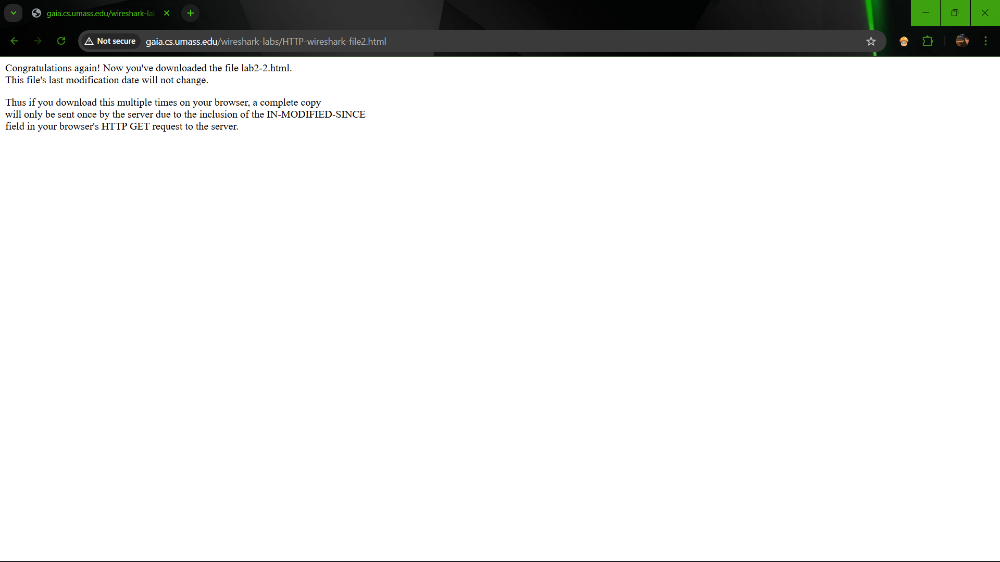
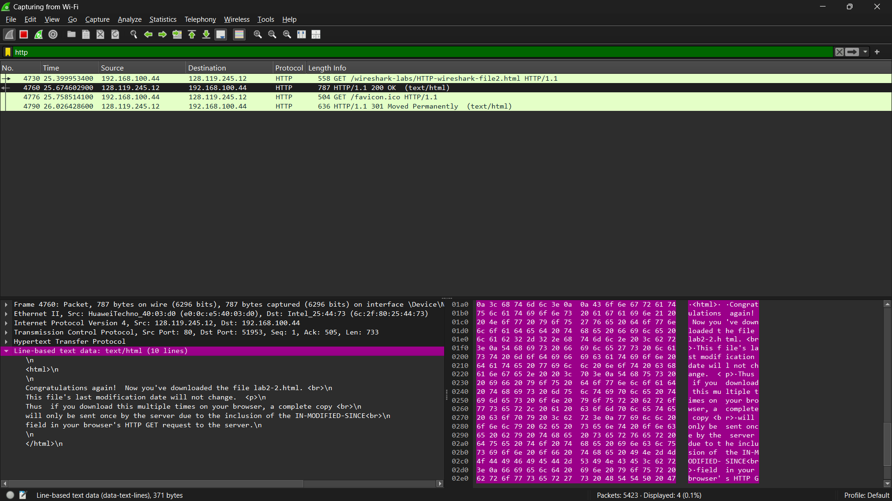
Hasil Pengamatan:
> Pada request kedua ditemukan adanya header: If-Modified-Since
Server kemudian memberikan respon:
~ 304 Not Modified jika file tidak berubah
~ 200 OK jika file sudah diperbarui
Analisis:
> Mekanisme ini menunjukkan bahwa HTTP memiliki fitur caching yang cukup penting dalam optimasi jaringan. Dengan adanya Conditional GET:
~ Client tidak perlu mengunduh ulang file jika tidak ada perubahan
~ Server hanya memberikan konfirmasi status
Dampaknya:
~ Mengurangi penggunaan bandwidth
~ Mempercepat waktu loading halaman
~ Mengurangi beban server
Jadi bisa disimpulkan bahwa caching ini sangat berperan dalam meningkatkan performa aplikasi web, terutama jika diakses berulang kali.

## 3. Retrieving Long Documents
Pada percobaan ini dilakukan pengambilan file HTML dengan ukuran yang lebih besar dibanding sebelumnya.
Langkah-langkah:
~ Mengakses file berukuran besar
~ Mengamati proses pengiriman data di Wireshark
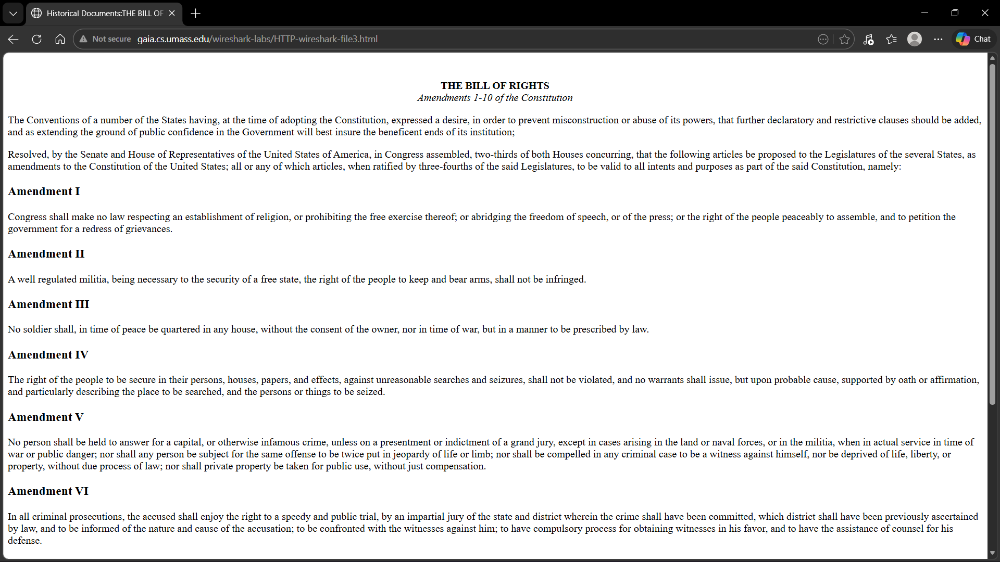
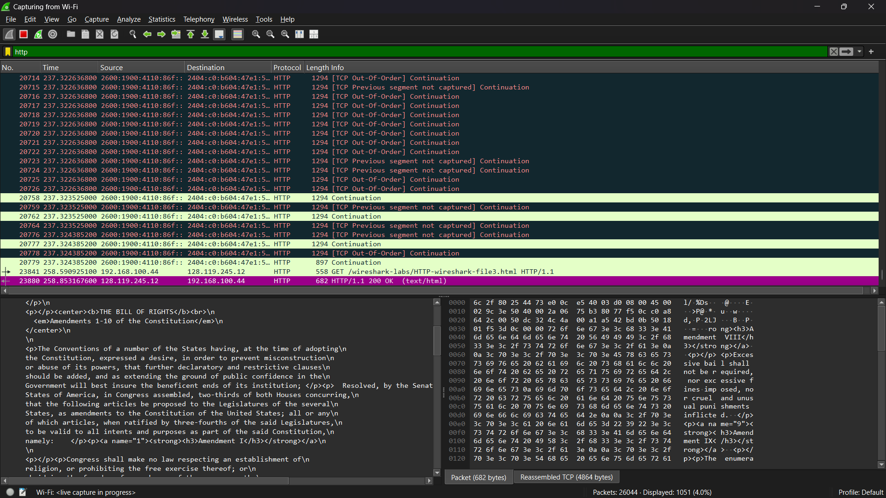
Hasil Pengamatan:
~ Data tidak dikirim dalam satu paket
~ Data dibagi menjadi beberapa segmen TCP
~ Muncul indikator “TCP segment of a reassembled PDU”
Analisis:
Hal ini menunjukkan bahwa: HTTP memanfaatkan TCP sebagai protokol transport dan TCP bertugas untuk memastikan data tetap sampai dengan benar
Ketika data berukuran besar:
~ Data akan dipecah menjadi beberapa segmen kecil
~ Setiap segmen dikirim secara bertahap
~ Di sisi client, segmen akan disusun kembali menjadi data utuh
Keuntungan dari mekanisme ini:
~ Mengurangi kemungkinan kehilangan data
~ Mempermudah proses retransmission jika terjadi error
~ Menjaga kestabilan jaringan
Ini juga memperlihatkan bahwa HTTP tidak bekerja sendiri, tapi sangat bergantung pada protokol lain di bawahnya.

## 4. HTML Documents dengan Embedded Objects
Percobaan ini dilakukan untuk melihat bagaimana browser menangani halaman web yang memiliki banyak komponen tambahan.
Langkah-langkah:
~ Mengakses halaman yang mengandung gambar atau objek lain
~ Mengamati jumlah request yang terjadi
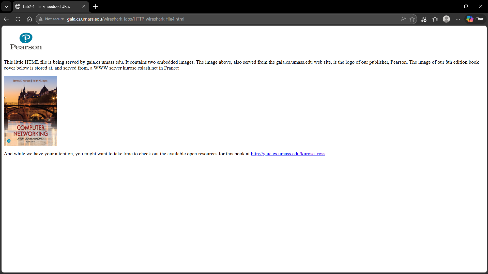
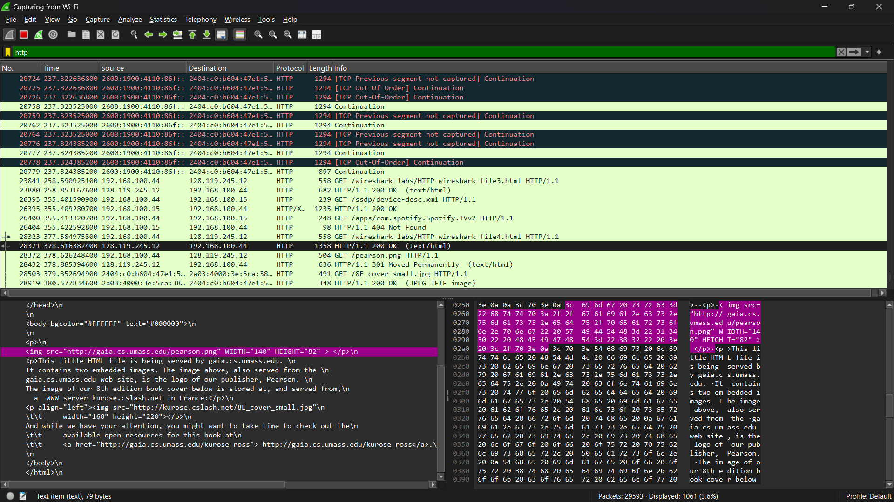
Hasil Pengamatan: Terdapat banyak HTTP GET request dan setiap objek (gambar, dll) memiliki request masing-masing
Analisis:
> Hal ini terjadi karena:
    ~ File HTML hanya berisi struktur dan referensi
    ~ Objek lain harus diambil secara terpisah oleh browser
Prosesnya:
~ Browser mengambil file HTML utama
~ Browser membaca isi HTML
~ Browser menemukan referensi objek tambahan
~ Browser mengirim request baru untuk setiap objek
Dampaknya:
~ Semakin banyak objek → semakin banyak request
~ Bisa mempengaruhi performa loading halaman
Makanya dalam pengembangan web modern, biasanya dilakukan optimasi seperti:
~ Menggabungkan file (bundling)
~ Menggunakan caching
~ Mengurangi jumlah request

## 5. HTTP Authentication
Pada percobaan terakhir dilakukan akses ke halaman yang memerlukan autentikasi (login).
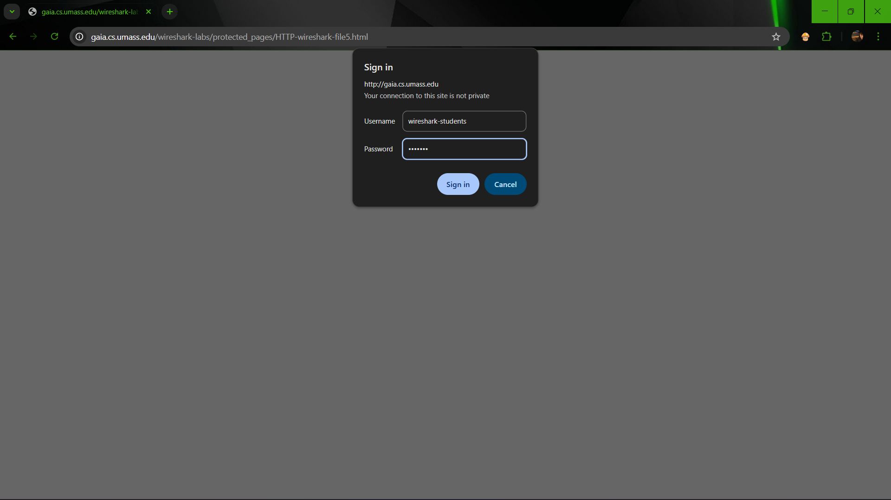
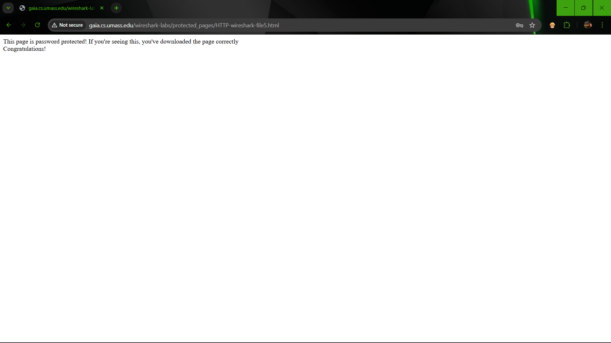
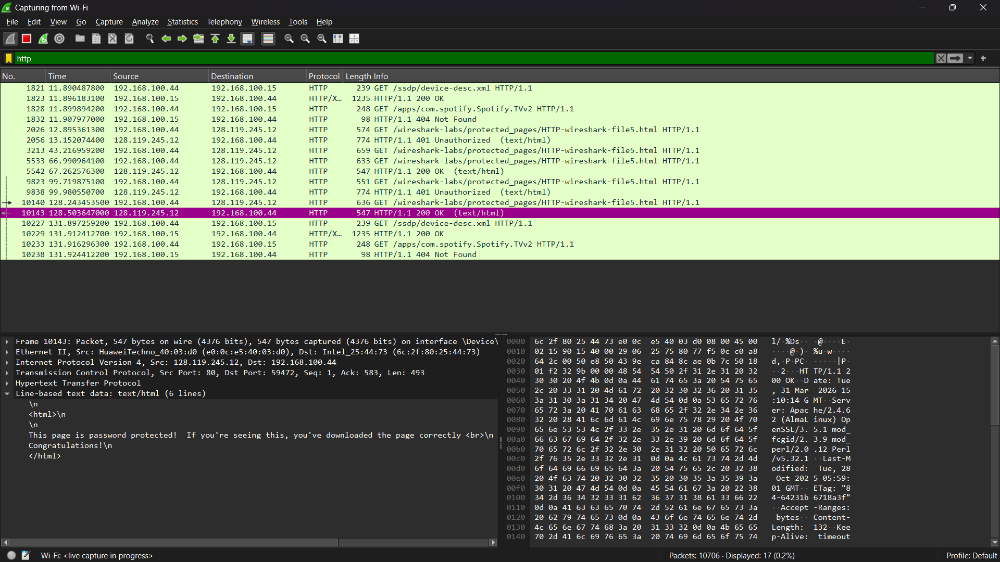
Hasil Pengamatan:
~ Username dan password dikirim dalam bentuk Base64 encoding
~ Data masih bisa terlihat di Wireshark
Analisis:
> Base64 bukanlah metode keamanan, melainkan hanya encoding. Artinya: Data tidak dilindungi secara aman dan siapa pun yang menangkap paket bisa mendecode data tersebut
Risiko:
~ Kebocoran informasi sensitif
~ Rentan terhadap serangan sniffing
Solusi:
~ Menggunakan HTTPS (HTTP Secure)
~ HTTPS mengenkripsi data menggunakan SSL/TLS
Dengan HTTPS: Data tidak bisa dibaca secara langsung dan keamanan komunikasi lebih terjamin

## Kesimpulan
Dari praktikum yang telah dilakukan, dapat disimpulkan bahwa HTTP merupakan protokol yang bekerja dengan konsep request dan response antara client dan server. Setiap aktivitas browsing pada dasarnya adalah proses pertukaran pesan antara kedua pihak tersebut.

Selain mekanisme dasar, HTTP juga memiliki fitur tambahan seperti caching melalui Conditional GET yang berfungsi untuk meningkatkan efisiensi jaringan. Dalam pengiriman data besar, HTTP memanfaatkan TCP untuk membagi data menjadi beberapa segmen agar proses pengiriman lebih stabil dan terkontrol.

Kemudian, dalam implementasinya, satu halaman web tidak hanya terdiri dari satu request saja, melainkan bisa terdiri dari banyak request terutama jika terdapat objek tambahan seperti gambar atau file lainnya. Hal ini menjadi salah satu faktor yang mempengaruhi performa loading halaman.

Dari sisi keamanan, HTTP masih memiliki kelemahan karena data dikirim tanpa enkripsi. Oleh karena itu, penggunaan HTTPS menjadi sangat penting untuk menjaga keamanan data, terutama dalam proses autentikasi.